# stable diffusion webui

## diffusion模型介绍
diffusion 是当前主流的图像生成模型，stable diffusion、Midjourney、DALL-E2 的内核都是 diffusion 模型

diffusion 整个过程分为两部分：**正向扩散**、**反向扩散**。可以比作向一杯水中放了一块儿冰糖，随着时间推移，糖分子运动会不停扩散直到均匀分布到水中，最后得到了一杯糖水。反之如果能知道糖分子运动的轨迹，就能让水中均匀分布的糖分子反向运动从而得到一块儿冰糖。冰糖融化的过程叫**正向扩散**，糖分子反向运动得到冰糖的过程叫**反向扩散**

通过例子来理解正向扩散和反向扩散的过程，正向扩散是不停地向图片中增加高斯模糊，也就是增加噪音，使得图片变成一张“雪花图”，反向扩散是来将一张“雪花图”通过预测减少噪音，来还原出一张图片

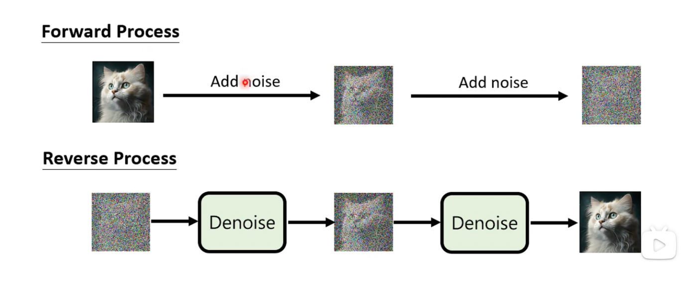

## stable diffusion webui 部署

stable diffusion webui 的 [GitHub](https://github.com/AUTOMATIC1111/stable-diffusion-webui) 上有部署教程，也可以使用b站大佬秋枼的傻瓜包（win系统）：

- [N卡](https://www.bilibili.com/video/BV1iM4y1y7oA/)
- [A卡](https://www.bilibili.com/read/cv26557731/)

如果使用的是mac，或者显卡性能比较差可以使用一些云部署：

- [autodl](https://www.autodl.com/home)
- [featurize](https://featurize.cn?s=b5b597fbbe7d43dbb8514d83b7bde373)
- [aliyun](https://fcnext.console.aliyun.com/overview)

这里使用推荐使用featurize进行部署，可以[点击这里跳转](https://featurize.cn?s=b5b597fbbe7d43dbb8514d83b7bde373)帮我蹭个拉新奖励，这里是[使用教程](https://docs.featurize.cn)

根据教程租好机器并打开工作区看到这个界面就算成功了
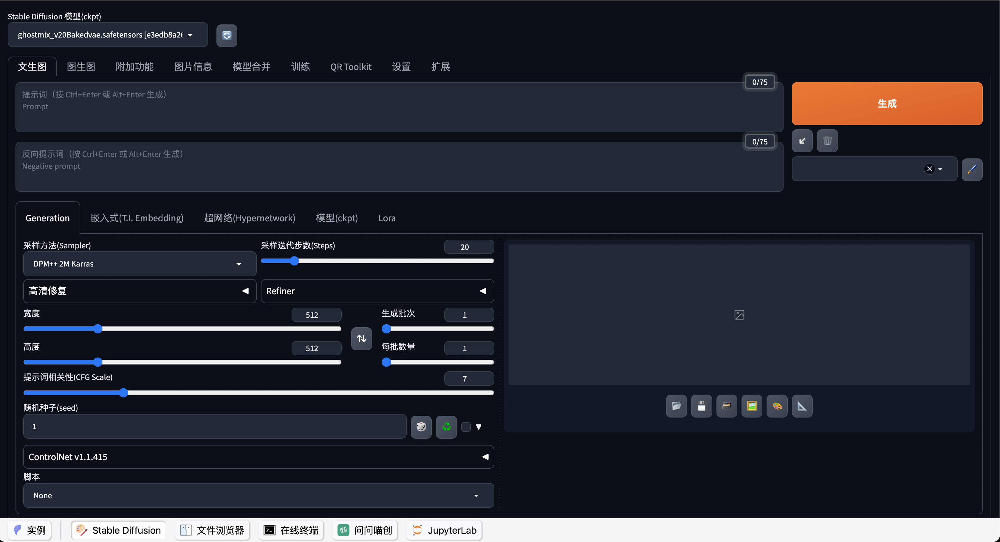

如果想上传一些模型则需要打开文件浏览器，在**stable-diffusion-webui/models/Stable-diffusion**目录下上传，其中模型可以从[C站（civitai）](https://civitai.com/)

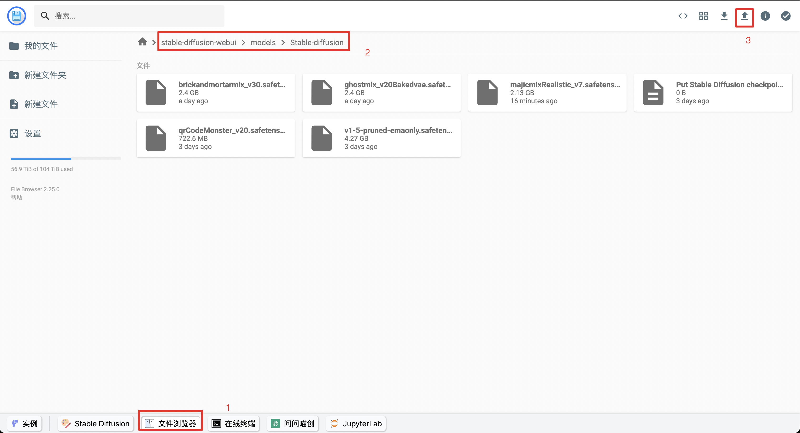

## stable diffusion webui 操作面板介绍

打开Stable diffusion webui菜单默认展示文生图（text2img）tab

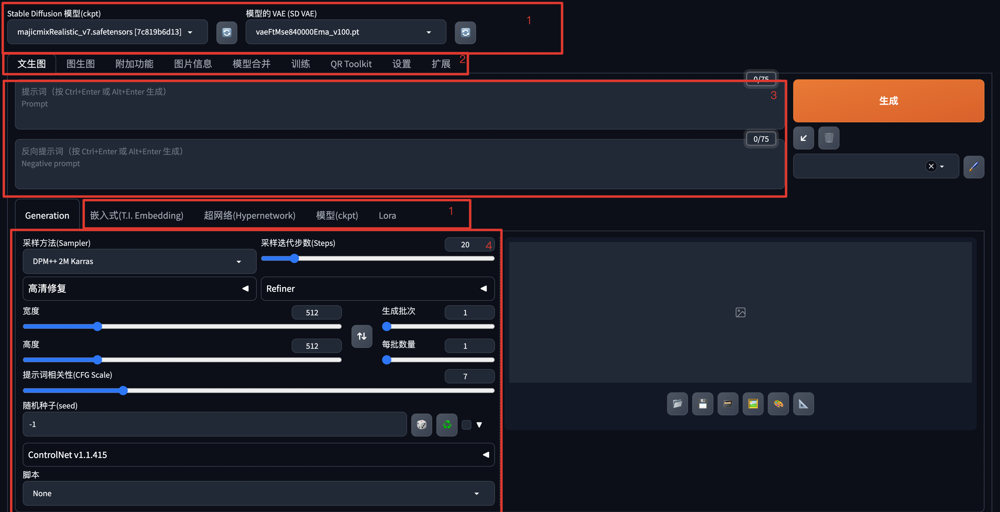

布局大致分为几个区域：
1. 模型
2. 插件
3. 提示词配置
4. 参数配置

### 模型

想生成一张完成度高的图片不能只靠一类模型，可以在c站中查看大概有多少种模型


针对几种常用的做下介绍：

#### Checkpoint
Checkpoint 文件是 stable diffusion 模型训练过程中定期保存的状态快照，在 stable diffusion 中的应用作为主模型来使用，一般用来确定画图方向使用，下面是用同一参数不同的 Checkpoint 模型生成的图

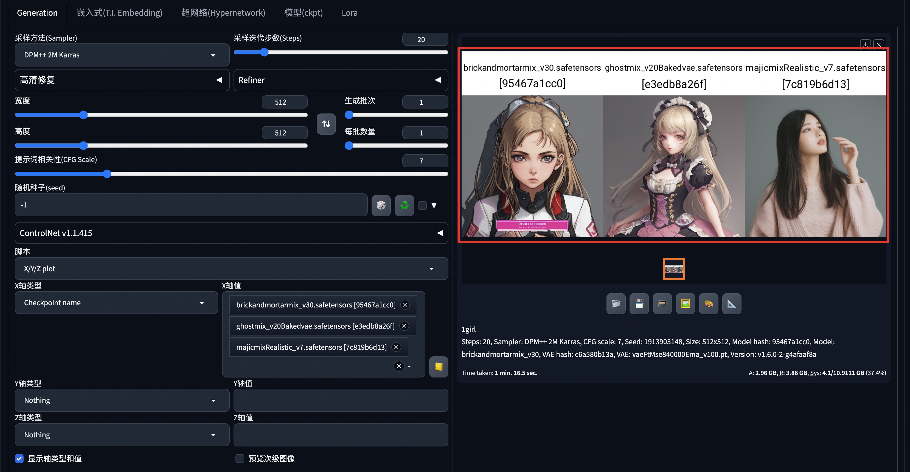

#### Embedding

将复杂的数据，如单词、节点或类别特征，转化为简洁的向量表示，如果你想生成守望先锋中的角色DVA，但是又描述不清关键词的时候，可以使用 Embedding 模型来让生成的图片变得更准确

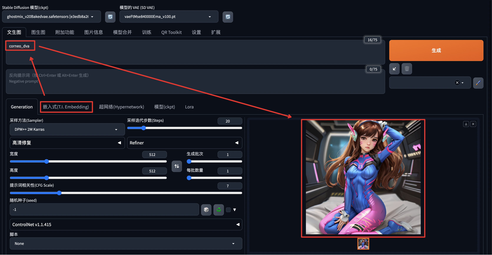

但是缺点也很明显，过于精准的关键词会影响输入关键词来控制生成图片，比如我想生成一个男DVA，即使在关键词中输入了“man”依然变性失败

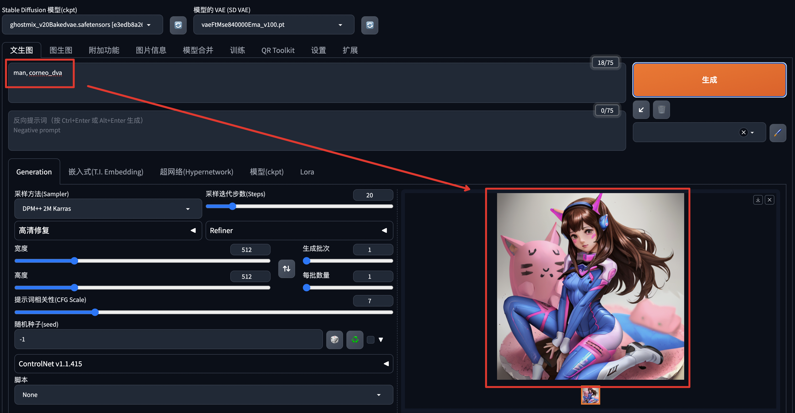

#### LoRA

原本并非用于 AI 绘画领域，它是微软的研究人员为了解决大语言模型微调而开发的一项技术，因此像 GPT3.5 包含了 1750 亿量级的参数，如果每次训练都全部微调一遍体量太大，而有了 lora 就可以将训练参数插入到模型的神经网络中去，而不用全面微调。

使用LoRA可以细化生成图片的细节，比如人物、场景等

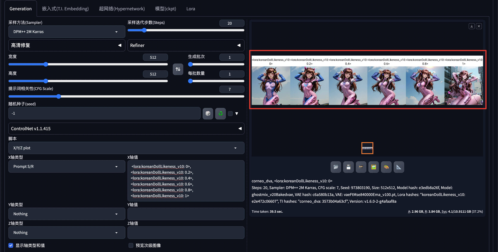

#### Hypernetwork 

是一种神经网络，通过动态生成或调整另一神经网络的参数，以增强模型的灵活性和适应性，常应用于元学习和神经架构搜索，Hypernetwork和LoRA在生成图片的功能上类似，训练方式有一些不同，可以看作是LoRA青春版

#### VAE 
一种生成模型，通过编码器将输入映射到潜在空间，并通过解码器生成具有多样性的数据样本。

> stable diffusion中是有VAE模型参与的，此处的VAE是一个拓展

VAE并不会改变生成图片的结构，更像是对生成的图像加了一层滤镜，这个是 vae-ft-mse-840000-ema-pruned 模型的效果

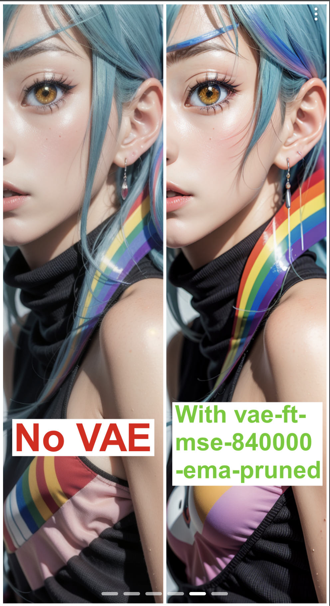

### 插件

stable diffusion webui可以使用插件来增强功能或者增强体验，需要去扩展tab => 加载脚本列表 => 筛选需要的脚本 => 找到并安装

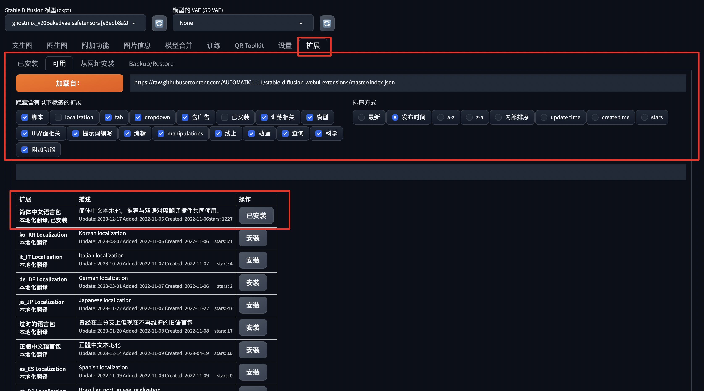

或是通过git仓库直接下载

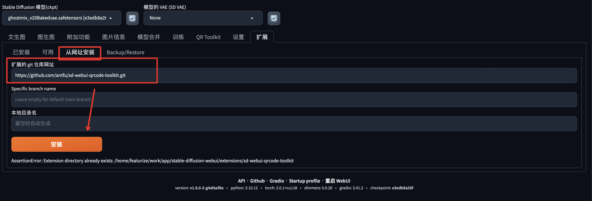

### 提示词

提示词可以为生成图片提供线索，也有人称之为咒语，可以是一句话，但是最好拆成一些描述词汇使得AI更能识别出其中含义，如果不知道如何描述提示词可以去这个[咒语词典](http://tag.zoos.life/)里找

关键词分为正向关键词和反向关键词，正向关键词用于引导图片生成的方向，比如这个图片的正向关键词大致意思为：杰作，最好的质量，看着观众，女孩，独奏，微笑，坐着，帽子，肩部剪裁，辫子，连衣裙，白花等，反向为：坏的手, 消极，质量差等

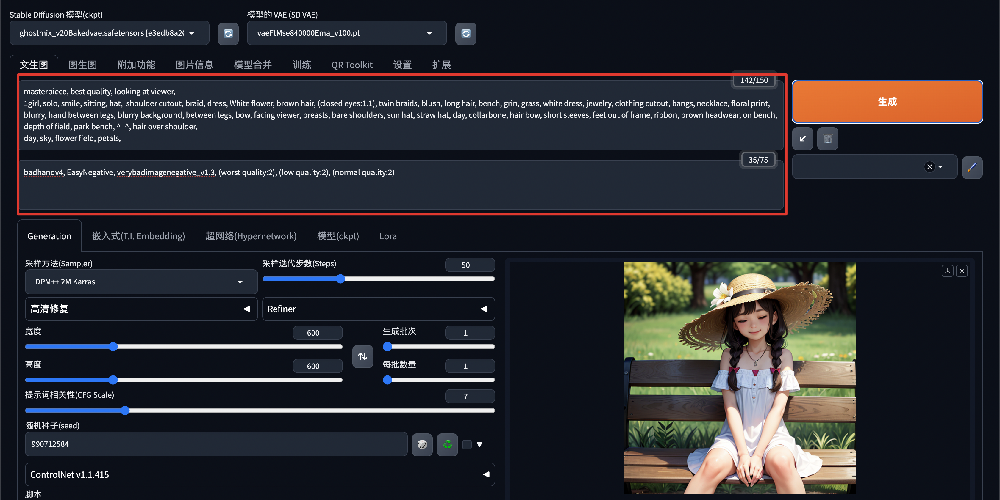

正向关键词
```text
masterpiece, best quality, looking at viewer,
1girl, solo, smile, sitting, hat,  shoulder cutout, braid, dress, White flower, brown hair, (closed eyes:1.1), twin braids, blush, long hair, bench, grin, grass, white dress, jewelry, clothing cutout, bangs, necklace, floral print, blurry, hand between legs, blurry background, between legs, bow, facing viewer, breasts, bare shoulders, sun hat, straw hat, day, collarbone, hair bow, short sleeves, feet out of frame, ribbon, brown headwear, on bench, depth of field, park bench, ^_^, hair over shoulder,
day, sky, flower field, petals,
```

反向关键词
```text
badhandv4, EasyNegative, verybadimagenegative_v1.3, (worst quality:2), (low quality:2), (normal quality:2)
```

其中关键词越靠前权重越高，也可以通过语法修改权重（可叠加使用，比如："((()))"），比如：
- () - 表示权重 * 1.1
- [] - 表示权重 * 0.9
- {} - 表示权重 * 1.05

如果嵌套起来可读性差也可以直接写权重，比如：(White flower: 1.2)，意思是将 White flower 关键词权重 * 1.2，权重可以改变某个因素在画中的占比但也不是越多越好，如下：

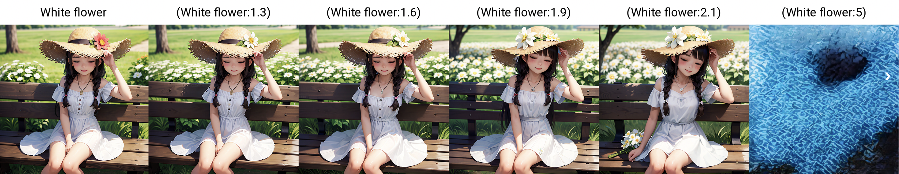

一些小模型使用也会出现在关键词中，比如：LoRA

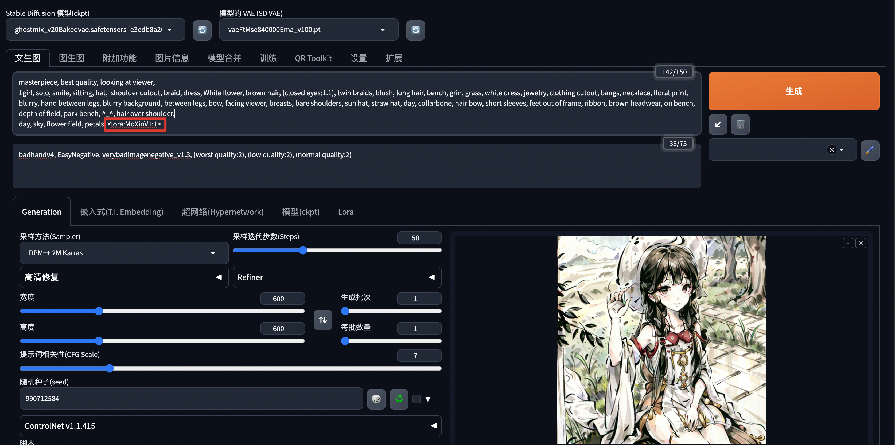


### 参数配置

使用参数可以控制生成图片生成数量、质量以及尺寸，介绍几个比较重要的参数

#### 采样器（Sampler）

反向扩散的过程是不断去噪的过程，整个去噪的过程就是**采样**，而**采样器**就是整个去噪的方法，不同的采样器影响图片的收敛程度、产出时间、产出质量，下面是总结了一些采样器的特性，以及用不同的采集器生成出的图像

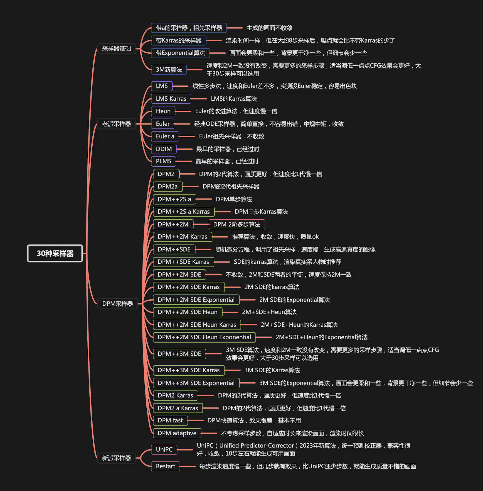
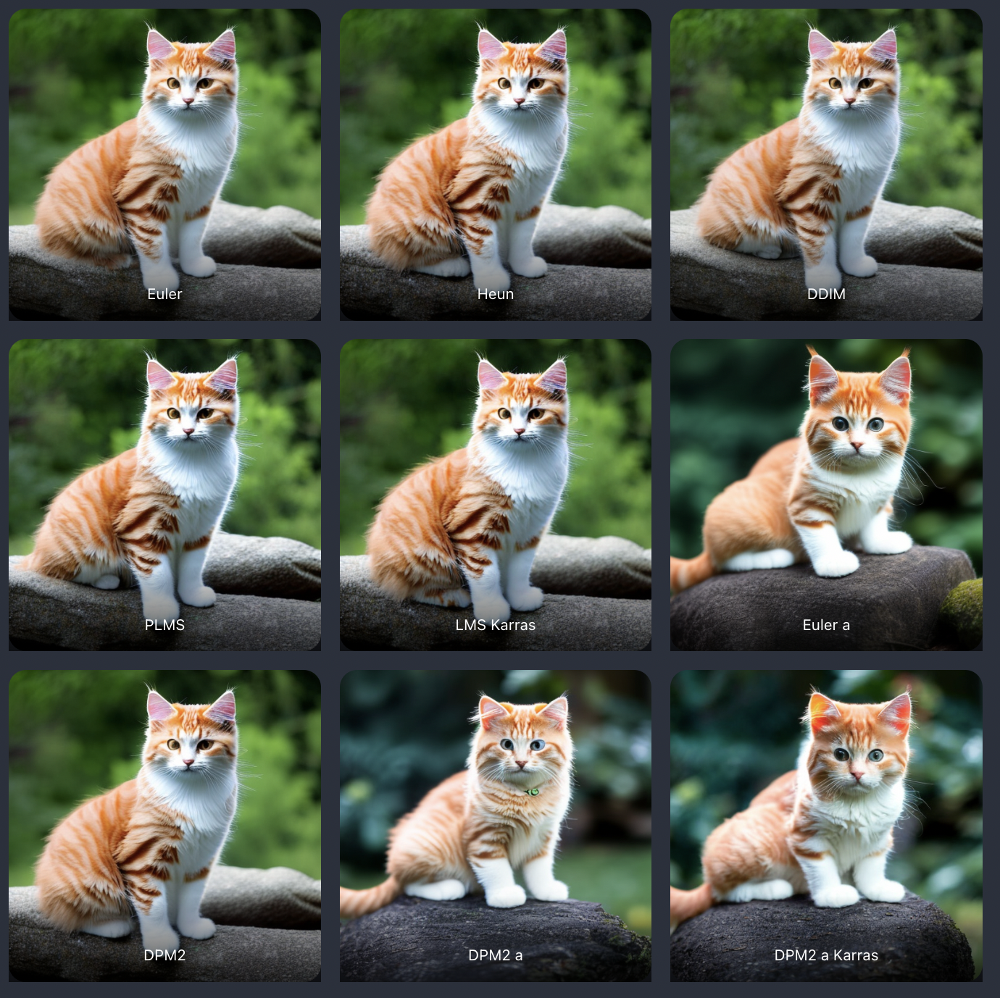
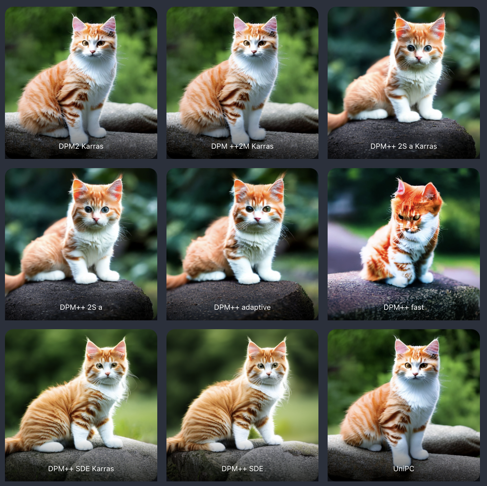

#### 采样步数（Steps）

采样步数就是反向扩散的步数，随着采样步数的增加，图片中的噪声会越来越少，图片也就是越来越清晰

<video src="d1253466-d752-11ed-ae93-26fa423ce539-v1_f4_t2_LFtLS463.mp4" controls title="Title"></video>

以下是不同采样器在 0 - 50 步的产出结果：


#### 种子（seed）

种子是指生成出图片的种子，比如生成了一张比较满意的图片，可以通过设置该图片的种子来变换风格
