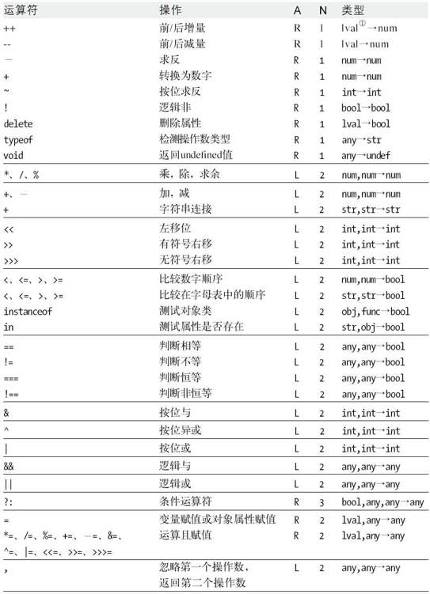

<!--
 * @Author: mamingzhe marx10086@gmail.com
 * @Date: 2023-03-02 19:01:45
 * @LastEditors: mamingzhe marx10086@gmail.com
 * @LastEditTime: 2023-03-02 19:05:26
 * @FilePath: /gitHub/note/docs/JS/运算符.md
 * @Description: 这是默认设置,请设置`customMade`, 打开koroFileHeader查看配置 进行设置: https://github.com/OBKoro1/koro1FileHeader/wiki/%E9%85%8D%E7%BD%AE
-->
# 运算符

## 优先级

表是按照优先级从上到下排序的，其中 A 列表示执行顺序，从 L 至 R，N 列表示影响个数