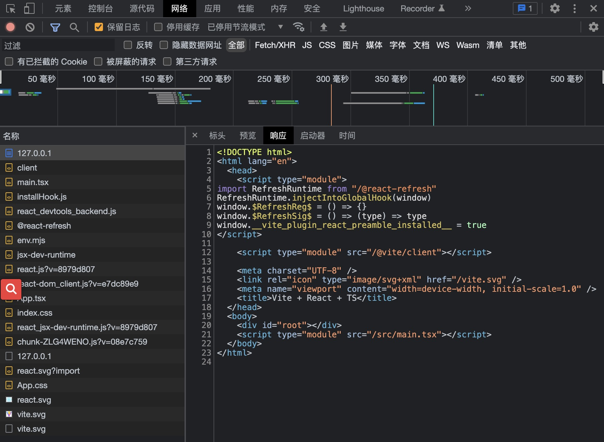
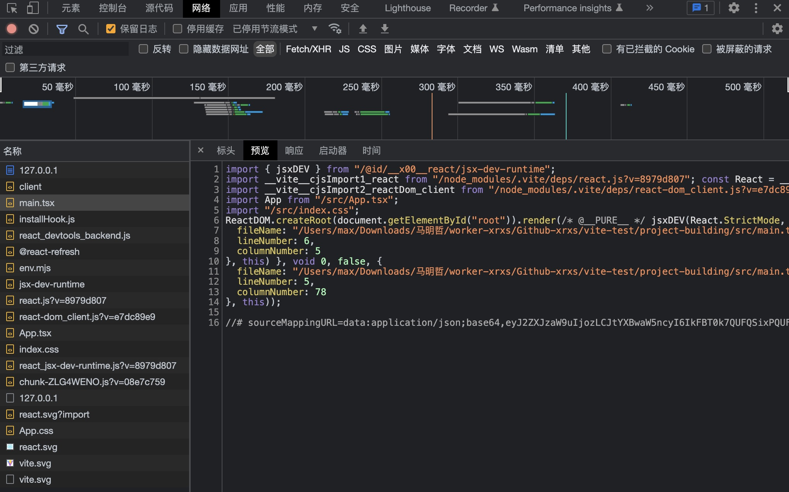
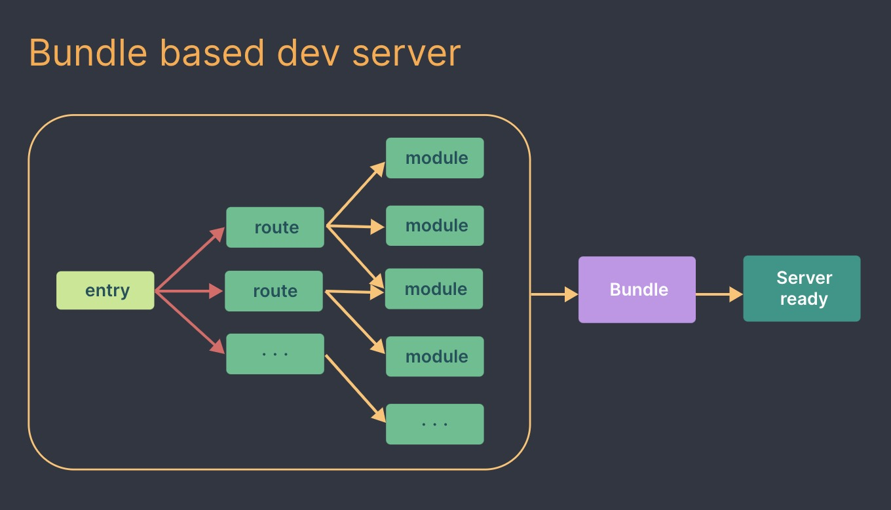
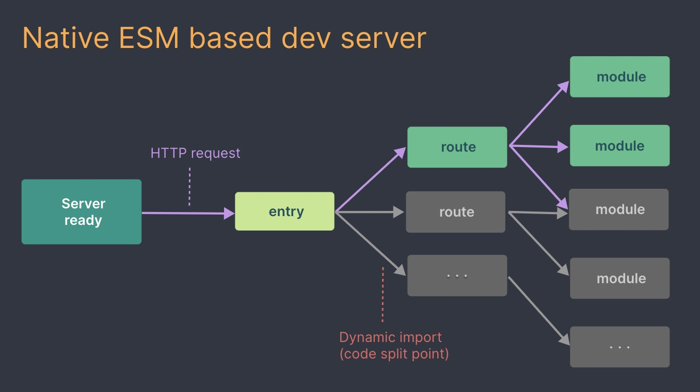

# 项目构建

本章我们搭建一个 vite + react + ts 项目，并逐步解决在实战中项目构建问题

```终端
pnpm create vite
```

文件结构如下

```txt
├── index.html
├── package.json
├── pnpm-lock.yaml
├── public
│   └── vite.svg
├── src
│   ├── App.css
│   ├── App.tsx
│   ├── assets
│   │   └── react.svg
│   ├── index.css
│   ├── main.tsx
│   └── vite-env.d.ts
├── tsconfig.json
├── tsconfig.node.json
└── vite.config.ts
```

## 项目命令

```json
// package.json
{
  "name": "project-building",
  "private": true,
  "version": "0.0.0",
  "type": "module",
  "scripts": {
    "dev": "vite", // 开发
    "build": "tsc && vite build", // 打包
    "preview": "vite preview" // 打包后预览
  },
  "dependencies": {
    "react": "^18.2.0",
    "react-dom": "^18.2.0"
  },
  "devDependencies": {
    "@types/react": "^18.0.26",
    "@types/react-dom": "^18.0.9",
    "@vitejs/plugin-react": "^3.0.0",
    "typescript": "^4.9.3",
    "vite": "^4.0.0"
  }
}
```

<code>package.json</code> 中提供了三个命令，分别应用于开发、打包以及打包后预览

## 开发构建

<code>pnpm dev</code> 命令会启动开发服务器 Vite Dev Server，当我们访问 Vite Dev Server 时会将项目中 <code>index.html</code> 文件内容返回

```html
<!-- index.html -->
<!DOCTYPE html>
<html lang="en">
  <head>
    <meta charset="UTF-8" />
    <link rel="icon" type="image/svg+xml" href="/vite.svg" />
    <meta name="viewport" content="width=device-width, initial-scale=1.0" />
    <title>Vite + React + TS</title>
  </head>
  <body>
    <div id="root"></div>
    <script type="module" src="/src/main.tsx"></script>
  </body>
</html>
```



浏览器收到 html 响应开始进行解析，当浏览器解析到 <code>\<script type="module" src="/src/main.tsx"\>\<\/script\></code> 的时候根据 ES 模块的特性会向服务器发起 <code>/src/main.tsx</code> 请求获取该文件

我们先看下 <code>/src/main.tsx</code> 文件的内容

```tsx
import React from 'react'
import ReactDOM from 'react-dom/client'
import App from './App'
import './index.css'

ReactDOM.createRoot(document.getElementById('root') as HTMLElement).render(
  <React.StrictMode>
    <App />
  </React.StrictMode>
)
```

但是浏览器是无法解析 tsx 的文件，那么 vite 是怎么做的呢



可以看到 Vite Dev Server 并没有简单的读取文件并返回，而是在读取后进行了代码转义，在响应体顶部可以看到一些 <code>import</code> 语句，在执行到每个 <code>import</code> 语句的时候浏览器根据路径请求资源。例如在响应体中可以看到 <code>import App from "/src/App.tsx";</code> 语句，在请求中也可以找到 <code>App.tsx</code> 的请求

这也就是 vite 的 no-bundle 理念的真正含义，利用 ES 模块特性实现按需加载。对比 webpack 先打包再加载的模式，vite 省去了耗时的打包流程，这也就是 vite 在开发模式下构建速度快的原因之一，官方提供了两张 bundle 和 no-bundel 的启动流程图

 


在项目中每个 <code>import</code> 语句都会发起请求，在返回的模块中如果含有 <code>import</code> 语句，则会继续发起请求，直到相关资源加载完毕

## 配置文件

vite 可以通过命令行传入参数，如 <code>vite --port=9527</code>，如果项目根目录存在 <code>vite.config.ts</code> 文件，则视该文件为配置文件，这里先简单看下配置文件，后面会详细分析

```ts
import { defineConfig } from 'vite'
import react from '@vitejs/plugin-react'

// https://vitejs.dev/config/
export default defineConfig({
  plugins: [react()],
})
```

文件中只配置了 <code>@vitejs/plugin-react</code> 插件，该插件由官方提供，来提供 react 代码的编译以及热更新功能

vite dev server 默认 5174 端口，如果该端口被占用则自动加一

```ts
import { defineConfig } from 'vite'
import react from '@vitejs/plugin-react'

// https://vitejs.dev/config/
export default defineConfig({
  server: {
    port: 9527,
  },
  plugins: [react()],

})
```

如果想指定端口，可以配置 <code>server.port</code>

## 生产构建

生产环境中仍然需要将代码打包，虽然 ES 模块大多数浏览器兼容，但是这种方式会造成大量的网络请求。为了在生产环境有更好的性能，代码仍需要打包、tree shaking、按需引入等。<code>package.json</code> 中提供了 <code>build</code> 命令来进行项目打包

```json
"build": "tsc && vite build"
```

可以看到命令先执行 <code>tsc</code> 后再执行 <code>vite build</code> 进行打包，这是问什么呢？因为 vite 只提供了 ts 的编译功能，在打包时并没有 ts 的类型校验，所以在打包前利用 <code>tsc</code> 先进行类型校验后在打包。从 ts 配置文件 <code>tsconfig.json</code> 中也可以看出，实际 <code>tsc</code> 只做了类型校验，并没有进行 ts 代码编译

```json
{
  "compilerOptions": {
    // ...
    "noEmit": true,
  },
  // ...
}
```

刚才也说过，开发构建和生产构建的流程是不一样的，这可能会存在一些隐患，因此 vite 提供了预览打包项目的命令

```json
"preview": "vite preview"
```

命令会启动一个服务器，访问时会返回返回项目打包后的结果，就和 webpack 的开发流程类似
