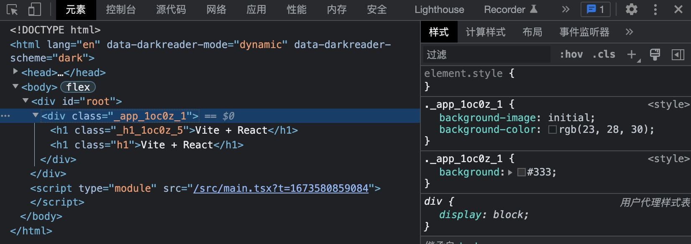
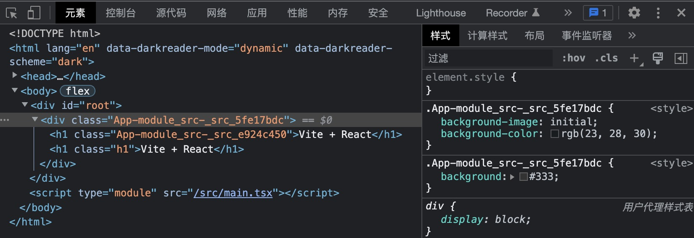
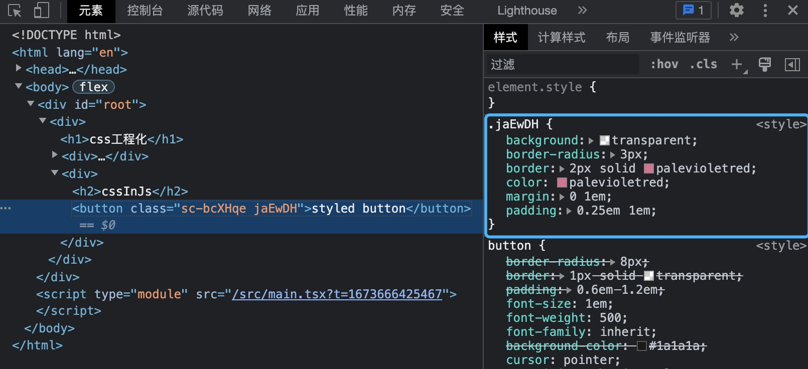
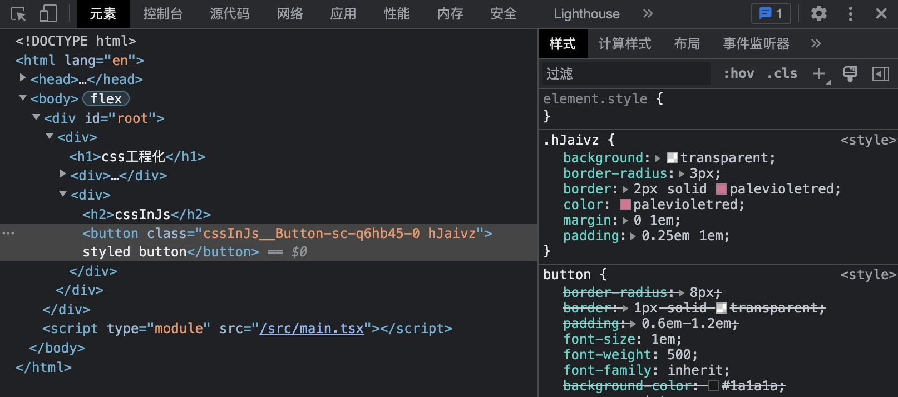
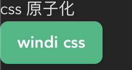

# css工程化

使用原生的 css 会遇到一些问题

- **开发体验差**，不支持嵌套、变量等方式
- **样式污染**，不同模块的同一个类会样式覆盖
- **浏览器兼容**，有些属性需要增加前缀，增加心智负担
- **打包体积**，一些没有使用过的样式会参与打包，增加打包体积

为了解决上述问题，产生出很多解决方案

- **css 预处理**，例如 <code>sass/scss</code> 可以在 css 中使用嵌套、变量、条件判断、循环等来提升 css 灵活性
- **css modules**，将类名处理成哈希，这样避免样式污染的问题
- **PostCSS**，处理和解析 css，功能非常强大，可以自动添加属性前缀、转化属性单位等
- **css in js**，在 js 中书写 css 代码，使得代码灵活以及解决污染问题，方式比较激进
- **css 原子化**，提供常用 css 样式，简化样式语法

## css 预处理

vite 支持 <code>scss/sass</code>、<code>less</code>、<code>styl</code>、<code>stylus</code> 预处理器，但是需要手动安装对应依赖

```终端
pnpm i scss -D
```

这样就可以在项目中使用 scss 了，vite 在这方面做到了零配置

在使用 scss 中会写一些全局变量，在使用时需要将变量注入就可以使用了

```scss
// src/style/inject.scss
$color-red: red;

// src/App.scss
@import "@/style/inject.scss";

h1 {
  color: $color-red;
}
```

但是每使用全局变量都需要引入 <code>inject.scss</code> 非常麻烦，我们可以通过 vite 自动引入

```ts
// vite.config.ts
import { defineConfig } from "vite";
import react from "@vitejs/plugin-react";
import path from "path";

// https://vitejs.dev/config/
export default defineConfig({
  // ...

  css: {
    preprocessorOptions: {
      scss: {
        additionalData: `@import "${path.resolve(__dirname, "./src/style/inject.scss")}";`,
      },
    },
  },
});
```

配置会将在 scss 文件中注入 <code>@import "xxx";</code> 的代码，这样就可以在任意的 scss 文件中使用 <code>inject.scss</code> 中设置的变量了

## css modules

vite 内置了 css modules，会对后缀带有 <code>.module</code> 的样式文件自动使用 css modules

我们将 <code>App.scss</code> 改为 <code>App.module.scss</code>，<code>App.tsx</code> 组件也需要一些改动

```tsx
import style from "./App.module.scss";

export default function App() {
  return (
    <div className={style.app}>
      <h1 className={style.h1}>Vite + React</h1>
      <h1 className="h1">Vite + React</h1>
    </div>
  );
}
```

回到浏览器检查元素可以看到，类名中增加了哈希值



也可以通过修改 vite 配置来控制 css modules 的格式

```ts
import { defineConfig } from "vite";

// https://vitejs.dev/config/
export default defineConfig({
  // ...

  css: {
    modules:{
      generateScopedName: "[name]_[path]_[folder]_[sha256:hash:8]"
    }
  },
});
```

<code>generateScopedName</code> [详细配置](https://github.com/webpack/loader-utils#interpolatename)，现在看下浏览器检查元素



## PostCSS

PostCSS 可以在根目录下创建配置文件 <code>postcss.config.js</code>，不过 vite 的配置文件中也提供了 PostCss 的配置入口

简单配置一个 <code>autoprefixer</code> 插件，为部分 css 样式添加前缀

```ts
import { defineConfig } from "vite";
import autoprefixer from "autoprefixer";

// https://vitejs.dev/config/
export default defineConfig({
  // ...

  css: {
    postcss: {
      plugins: [autoprefixer()],
    },
  },
});
```

我们添加一个样式属性 <code>text-decoration</code>，在浏览器中查看样式就会发现自动新增了 <code>-webkit-text-decoration</code> 属性

```css
/* App.module.scss */
.h1 {
  color: red;
  text-decoration: dashed;
}

/* 浏览器检查元素 */
._h1_1fbua_5 {
  color: red;
  -webkit-text-decoration: dashed;
  text-decoration: dashed;
}
```

PostCSS 插件有很多，可以通过这个[网站查找](https://postcss.docschina.org/doc/plugins.html)

## css in js

css in js 实现的库有很多，比如：<code>styled-components</code>，该库提供的工具函数可以传入样式生成组件，从而提高 css 灵活性以及样式污染的问题，写一个例子简单使用

```tsx
import styled from "styled-components";

const Button = styled.button`
  background: transparent;
  border-radius: 3px;
  border: 2px solid palevioletred;
  color: palevioletred;
  margin: 0 1em;
  padding: 0.25em 1em;
`;

function CssInJs() {
  return (
    <div>
      <h2>cssInJs</h2>

      <Button>styled button</Button>
    </div>
  );
}

export default CssInJs;
```

我们利用 <code>styled-components</code> 构建一个 <code>Button</code> 组件，当我们从浏览器中查看元素时会遇到一些问题



从打包结果来看，<code>Button</code> 组件以及对应样式都没有问题，但是 <code>Button</code> 组件的类名是随机字符串，在浏览器中调试非常不友好

可以使用 babel-plugin-styled-components 来解决问题

```ts
import { defineConfig } from "vite";
import react from "@vitejs/plugin-react";

export default defineConfig({
  // ...

  plugins: [
    react({
      babel: {
        plugins: ["babel-plugin-styled-components"],
      },
    }),
  ],
});
```

我们在看下打包结果，<code>Button</code> 组件新增了一个类来增加语义化



## css 原子化

<code>Windi CSS</code> 是比较流行的库，该库预设了很多常用样式，元素只需要写对应类即可，下面介绍下怎么使用，首先进行安装

```终端
<!-- 这是Windi对应的vite插件 -->
npm i -D vite-plugin-windicss windicss
```

之后在 vite 配置中加入插件

```ts
import { defineConfig } from "vite";
import WindiCSS from 'vite-plugin-windicss'

export default defineConfig({
  // ...
  plugins: [
    // ...
    WindiCSS()
  ],
});
```

接下来需要在 <code>main.tsx</code> 引入全局样式

```tsx
import 'virtual:windi.css'
```

之后我们就可以在项目中使用了

```tsx
function Windi() {
  return (
    <div>
      <h2>css 原子化</h2>

      <button className="py-2 px-4 font-semibold rounded-lg shadow-md text-white bg-green-500 hover:bg-green-700">
        windi css
      </button>
    </div>
  );
}

export default Windi;
```

展示效果



Windi Css 还可以使用元素属性的方式书写 css，以及封装样式类等功能，这里就不多介绍，[可以查看官网](https://windicss.org/)

## 总结

这章我们了解了 css 原生的问题，以及通过 <code>css 预处理</code>、<code>css modules</code>、<code>PostCSS</code>、<code>css in js</code>、<code>css 原子化</code> 来提升 css 灵活性、工程化来降低开发的心智负担
