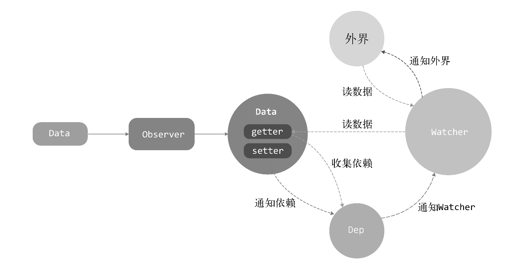

# 派发更新

我们在上一章分析了依赖收集的过程，那么Vue中数据改变会触发可观察对象的setter，我们先来回顾下setter的视线

<font color="#999">文件路径: /vue/src/core/observer/index.js</font>

```js
export function defineReactive (
  obj: Object,
  key: string,
  val: any,
  customSetter?: ?Function,
  shallow?: boolean
) {
  // ...
  Object.defineProperty(obj, key, {
    // ...
    set: function reactiveSetter (newVal) {
      const value = getter ? getter.call(obj) : val
      /* eslint-disable no-self-compare */
      if (newVal === value || (newVal !== newVal && value !== value)) {
        return
      }
      /* eslint-enable no-self-compare */
      if (process.env.NODE_ENV !== 'production' && customSetter) {
        customSetter()
      }
      // #7981: for accessor properties without setter
      if (getter && !setter) return
      if (setter) {
        setter.call(obj, newVal)
      } else {
        val = newVal
      }
      childOb = !shallow && observe(newVal)
      dep.notify()
    }
  })
}
```

setter中有几个重要的逻辑：
- 通过<code>newVal === value || (newVal !== newVal && value !== value)</code>判断值是否改变，减少重复渲染的可能（后面这个判断暂时没看懂）
- <code>childOb = !shallow && observe(newVal)</code>将子属性（如果属性值是对象）也变成可观察对象
- <code>dep.notify()</code>通知依赖更新，这是本章的重中之重，我们将来分析依赖更新的过程

## 过程分析

当我们修改了数据就会调用可观察对象的<code>setter</code>，而<code>setter</code>最终通过<code>dep.notify()</code>通知依赖的更新，<code>dep</code>就是我们上一章所说收集依赖的实例

### 通知观察者

<font color="#999">文件路径: /vue/src/core/observer/dep.js</font>

```js
export default class Dep {
  // ...

  // 更新依赖
  notify () {
    // stabilize the subscriber list first
    const subs = this.subs.slice()
    if (process.env.NODE_ENV !== 'production' && !config.async) {
      // subs aren't sorted in scheduler if not running async
      // we need to sort them now to make sure they fire in correct
      // order
      subs.sort((a, b) => a.id - b.id)
    }
    for (let i = 0, l = subs.length; i < l; i++) {
      subs[i].update()
    }
  }
}
```

<code>notify</code>方法通过<code>subs[i].update()</code>通知观察者们（Watcher实例数组）更新，也就是调用<code>Watcher</code>实例的<code>update</code>方法

### 观察者更新

<font color="#999">文件路径: /vue/src/core/observer/watcher.js</font>

```js
export default class Watcher {
  // ...

  /**
   * Subscriber interface.
   * Will be called when a dependency changes.
   */
  update () {
    /* istanbul ignore else */
    if (this.lazy) {
      this.dirty = true
    } else if (this.sync) {
      this.run()
    } else {
      queueWatcher(this)
    }
  }

  // ...
}
```

<code>update</code>的方法非常简单，先处理了<code>lazy</code>和<code>sync</code>的情况，我们之后专门说。之后通过<code>queueWatcher(this)</code>走向观察者队列的逻辑

### 观察者队列

<font color="#999">文件路径: /vue/src/core/observer/scheduler.js</font>

```js
const queue: Array<Watcher> = []
let has: { [key: number]: ?true } = {}
let waiting = false
let flushing = false
let index = 0

/**
 * Push a watcher into the watcher queue.
 * Jobs with duplicate IDs will be skipped unless it's
 * pushed when the queue is being flushed.
 */
export function queueWatcher (watcher: Watcher) {
  const id = watcher.id
  if (has[id] == null) {
    has[id] = true
    if (!flushing) {
      queue.push(watcher)
    } else {
      // if already flushing, splice the watcher based on its id
      // if already past its id, it will be run next immediately.
      let i = queue.length - 1
      while (i > index && queue[i].id > watcher.id) {
        i--
      }
      queue.splice(i + 1, 0, watcher)
    }
    // queue the flush
    if (!waiting) {
      waiting = true

      if (process.env.NODE_ENV !== 'production' && !config.async) {
        flushSchedulerQueue()
        return
      }
      nextTick(flushSchedulerQueue)
    }
  }
}
```

<code>queueWatcher</code>函数的逻辑主要是维护执行<code>Watcher</code>队列，这是Vue做的渲染优化，不会每次数据更新都会触发渲染，而是把这些<code>Watcher</code>添加到一个队列里，在异步执行
- 通过<code>has</code>确定同一个<code>Watcher</code>只被添加一次
- <code>flushing</code>这里的逻辑是判断队列是否在执行，具体逻辑我们稍后分析，暂且值是false
- 通过<code>queue.push(watcher)</code>将<code>Watcher</code>添加至队列
- <code>waiting</code>是执行开关，避免正在执行队列过程中再次执行
- 通过<code>nextTick(flushSchedulerQueue)</code>执行队列，<code>nextTick</code>逻辑会在下一章专门研究，这里先当做使用<code>Promise</code>异步触发了<code>flushSchedulerQueue</code>，从而执行观察者队列

### 观察者队列执行

我们看下<code>flushSchedulerQueue</code>函数的逻辑

<font color="#999">文件路径: /vue/src/core/observer/scheduler.js</font>

```js
/**
 * Flush both queues and run the watchers.
 */
function flushSchedulerQueue () {
  currentFlushTimestamp = getNow()
  flushing = true
  let watcher, id

  // Sort queue before flush.
  // This ensures that:
  // 1. Components are updated from parent to child. (because parent is always
  //    created before the child)
  // 2. A component's user watchers are run before its render watcher (because
  //    user watchers are created before the render watcher)
  // 3. If a component is destroyed during a parent component's watcher run,
  //    its watchers can be skipped.
  queue.sort((a, b) => a.id - b.id)

  // do not cache length because more watchers might be pushed
  // as we run existing watchers
  for (index = 0; index < queue.length; index++) {
    watcher = queue[index]
    if (watcher.before) {
      watcher.before()
    }
    id = watcher.id
    has[id] = null
    watcher.run()
    // in dev build, check and stop circular updates.
    if (process.env.NODE_ENV !== 'production' && has[id] != null) {
      circular[id] = (circular[id] || 0) + 1
      if (circular[id] > MAX_UPDATE_COUNT) {
        warn(
          'You may have an infinite update loop ' + (
            watcher.user
              ? `in watcher with expression "${watcher.expression}"`
              : `in a component render function.`
          ),
          watcher.vm
        )
        break
      }
    }
  }

  // keep copies of post queues before resetting state
  const activatedQueue = activatedChildren.slice()
  const updatedQueue = queue.slice()

  resetSchedulerState()

  // call component updated and activated hooks
  callActivatedHooks(activatedQueue)
  callUpdatedHooks(updatedQueue)

  // devtool hook
  /* istanbul ignore if */
  if (devtools && config.devtools) {
    devtools.emit('flush')
  }
}
```

<code>flushSchedulerQueue</code>函数是保证观察者队列按照顺序依次执行，并且在执行后做一些收尾工作，先忽略<code>keep-alive</code>和<code>updated</code>生命周期的逻辑

- 将<code>flushing</code>置为true
- <code>queue.sort((a, b) => a.id - b.id)</code>对队列做了id从小到大的排序
  - 组件的更新顺序是从父到子，所以<code>Watcher</code>的创建顺序也是从父到子
  - 在mount阶段会创建一个<code>Watcher</code>，同时用户也可以在Vue实例中配置监听属性，本质都是<code>Watcher</code>实例。用户创建的<code>Watcher</code>实例要优先于mount阶段的<code>Watcher</code>实例
  - 如果父组件的<code>Watcher</code>正在更新，同时子组件被销毁，那么子组件对应的<code>Watcher</code>可以不执行，所以父组件应该先执行
- 遍历观察者队列，调用<code>watcher.run()</code>执行更新

我们回过头分析下<code>flushing</code>的逻辑

<font color="#999">文件路径: /vue/src/core/observer/scheduler.js</font>

```js
export function queueWatcher (watcher: Watcher) {
  const id = watcher.id
  if (has[id] == null) {
    has[id] = true
    if (!flushing) {
      queue.push(watcher)
    } else {
      // if already flushing, splice the watcher based on its id
      // if already past its id, it will be run next immediately.
      let i = queue.length - 1
      while (i > index && queue[i].id > watcher.id) {
        i--
      }
      queue.splice(i + 1, 0, watcher)
    }
    // ...
  }
}
```

当队列执行时<code>flushing</code>会置为true，如果这时候有数据改变了（比如配置的watch触发），这时会根据<code>Watcher</code>的id将其插入到队列的相应位置（队列id是从小到大）

### 观察者队列状态恢复

在看<code>watcher.run()</code>方法之前，我们暂时将流程走完

调用<code>resetSchedulerState</code>函数重置队列状态

<font color="#999">文件路径: /vue/src/core/observer/scheduler.js</font>

```js
const queue: Array<Watcher> = []
const activatedChildren: Array<Component> = []
let has: { [key: number]: ?true } = {}
let waiting = false
let flushing = false
let index = 0

function resetSchedulerState () {
  index = queue.length = activatedChildren.length = 0
  has = {}
  if (process.env.NODE_ENV !== 'production') {
    circular = {}
  }
  waiting = flushing = false
}
```

<code>resetSchedulerState</code>函数将一切变量重置初始状态

### 观察者更新视图

观察者队列在执行中触发了队列中每一个观察者的<code>run</code>方法，我们分析其实现

<font color="#999">文件路径: /vue/src/core/observer/watcher.js</font>

```js
export default class Watcher {
  // ...

  run () {
    if (this.active) {
      const value = this.get()
      if (
        value !== this.value ||
        // Deep watchers and watchers on Object/Arrays should fire even
        // when the value is the same, because the value may
        // have mutated.
        isObject(value) ||
        this.deep
      ) {
        // set new value
        const oldValue = this.value
        this.value = value
        if (this.user) {
          const info = `callback for watcher "${this.expression}"`
          invokeWithErrorHandling(this.cb, this.vm, [value, oldValue], this.vm, info)
        } else {
          this.cb.call(this.vm, value, oldValue)
        }
      }
    }
  }

  // ...
}
```

<code>run</code>就到了我们派发更新的最后一环：重新渲染
- 调用实例上<code>get</code>方法获取数据
- 如果满足新旧值不等、新值是对象类型、<code>deep</code>模式任何一个条件，就触发回调，并将新旧两个值传递，这也就是我们在Vue实例中配置<code>watch</code>时能获取新旧值的原因

<code>Watcher</code>的渲染实际上是在<code>const value = this.get()</code>这里触发的，而<code>get</code>函数会触发实例上<code>getter</code>函数，也就是在mount阶段创建<code>Watcher</code>实例时传入的渲染方法

<font color="#999">文件路径: /vue/src/core/instance/lifecycle.js</font>

```js
updateComponent = () => {
  vm._update(vm._render(), hydrating)
}
```

所以我们在修改数据，也就是可观察对象时会触发渲染的原因，接着就会重新执行<code>patch</code>过程，和首次渲染有所不同，我们之后详细说明

## 总结



通过本章分析，我们对Vue如何通知依赖更新有了认识。当修改数据时会触发setter，会将收集依赖阶段收集到的观察者<code>Wtacher</code>放入队列，并通过<code>nextTick</code>执行，最终通过<code>run</code>触发更新。其中<code>nextTick</code>是优化渲染流程很重要的部分，我们下一章分析其实现