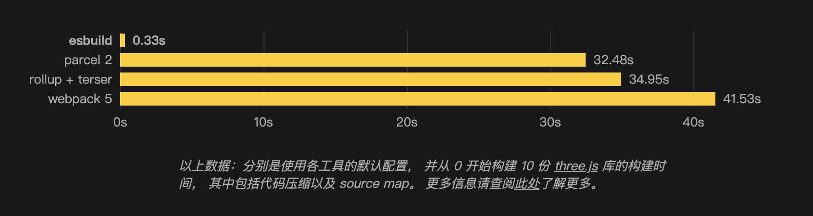

# 项目构建相关

这里并不探讨vue3的源码，只是为了学习vue3项目构建中使用的一些技术

## monorepo 仓库管理方式

vue3使用的是 **monorepo** 和 **TypeScript** 管理和开发代码，monorepo解释为单体仓库（mono repo），将耦合度高或依赖性强的项目整合到一个仓库下，通过人为的规则将这些项目划分开

vue3目录如下，将各个功能拆分出单个项目，都放在 <code>vue3/core/packages</code> 中

```txt
vue3/core
├── packages
│   ├── compiler-core
│   ├── compiler-dom
│   ├── compiler-sfc
│   ├── compiler-ssr
│   ├── reactivity
│   ├── reactivity-transform
│   ├── runtime-core
│   ├── runtime-dom
│   ├── runtime-test
│   ├── server-renderer
│   ├── sfc-playground
│   ├── shared
│   ├── size-check
│   ├── template-explorer
│   ├── vue
└── └── vue-compat
```

### monorepo 和 multirepos

**multirepos** 是多体仓库，这是比较常用的管理方式，每一个仓库下只存放该项目的代码

从multirepos迁移到monorepo，就是将所有仓库都合并在一起

```txt
/project1
/project2
/project3

↑ 合并为 ↓

/monorepo/project/project1
/monorepo/project/project2
/monorepo/project/project3
```

### monorepo 优点

- **代码透明**，业务相关的项目都在一个仓库中，使得某个项目组可以观察到所有项目的代码，更好的团队协作
- **更好的依赖管理**，一些公共库不需要包管理工具，直接根据路径导入
- **版本冲突**，由于公共库直接导入使用，所以该项目使用的公共库一直是最新版本，减少版本冲突
- **代码风格**，有利于统一整个代码风格
- **重大更新**，某个项目有重大变更其他的项目组在拉取代码时可以观察到，如果与变更项目依赖部分产生影响能及时发现
- **重构或更新**，如果一个业务穿插多个项目，可以在一个分支中完成
- **CI/CD**，可以使用同一套CI/CD部署

### monorepo 缺点

- **仓库庞大**，一些全局的命令会非常耗时，例如：git pull
- **污染主分支**，如果一个问题分支合并到主分支上，可能会影响所有项目，比较考验开发和审核的规则以及相关人员的素质
- **commit增多审查困难**，合并仓库就会导致commit增多，导致code review困难
- **权限管理**，gitHub并没有仓库下文件的管理系统

### monorepo 最佳实践

- 规范仓库中项目目录，便于查找
- 尽量保持分支的纯净
- 一次性提升所有依赖，减少出现版本冲突的情况
- git中使用浅克隆和分支过滤处理仓库
- 使用一些monorepo管理器，例如：lerna

## Vue3 构建结果

在项目中的 <code>node_modules/vue/dist</code> 中可以看到最终的vue3构建结果

```txt{2,5,7,8,10,12,13}
node_modules/vue/dist/
├── vue.cjs.js
├── vue.cjs.prod.js
├── vue.d.ts
├── vue.esm-browser.js
├── vue.esm-browser.prod.js
├── vue.esm-bundler.js
├── vue.global.js
├── vue.global.prod.js
├── vue.runtime.esm-browser.js
├── vue.runtime.esm-browser.prod.js
├── vue.runtime.esm-bundler.js
├── vue.runtime.global.js
└── vue.runtime.global.prod.js
```

除了TS声明文件 <code>.d.ts</code> 和 压缩后的代码 <code>.prod.js</code> 文件剩下的有7个版本

- <code>vue.cjs.js</code>，commonJS模块的版本
- <code>vue.esm-browser.js</code>，用于浏览器原生ES模块导入的版本，例如：<code>\<script type="module"></code>
- <code>vue.esm-bundler.js</code>，在构建工具中使用原声模块导入的版本
- <code>vue.global.js</code>，全局变量的版本，用于cdn引入

<code>vue.runtime.xxx.js</code>，为各个版本的运行时版，是没有编译器部分代码，因为在构建工具中可以使用 <code>vue-loader</code> 来完成编译，这样可以减少代码包体积。上面这些为完全版，是带有编译器部分的代码

> 编译器是将模板转化成渲染函数，例如：\<div>123\</div> => h("div", "123")

## esbuild 打包

在vue3开发阶段使用的就是esbuild打包

### esbuild 特点



esbuild是js打包工具，主要针对esm，其速度是webpack的很多倍，功能如下：

- 极快的速度，无需缓存
- 支持 ES6 和 CommonJS 模块
- 支持对 ES6 模块进行 tree shaking
- API 可同时用于 JavaScript 和 Go
- 兼容 TypeScript 和 JSX 语法
- 支持 Source maps
- 支持 Minification
- 支持 plugins

为什么这么快（暂时不研究只做了解）

- Go语言编写，比JavaScript运行效率更高（据说JS是毫秒级，Go是纳秒级）
- 代码都是官方编写，没有使用第三方依赖，更方便优化性能
- 避免不需要的内存分配

### 在vue3中的应用

vue3的开发中用到了esbuild打包

```json
{
  "private": true,
  "version": "3.2.45",
  "packageManager": "pnpm@7.1.0",
  "scripts": {
    "dev": "node scripts/dev.js",
    "dev-esm": "node scripts/dev.js -if esm-bundler-runtime",
  },
}
```

vue3仓库中的 <code>package.json</code> 中有两个命令，<code>dev</code> 和 <code>dev-esm</code> 都是运行开发构建，它们都运行了 <code>scripts/dev.js</code> 脚本

```js
// @ts-check
const { build } = require('esbuild') // 使用esbuild打包
const nodePolyfills = require('@esbuild-plugins/node-modules-polyfill') // 如果是node环境打包需要导入node内置模块
const { resolve, relative } = require('path')
const args = require('minimist')(process.argv.slice(2)) // 解析出命令行参数

const target = args._[0] || 'vue' // 参数中需要打包的项目
const format = args.f || 'global' // 打包的版本（cjs、esm-browser、esm-bundler、global）
const inlineDeps = args.i || args.inline // 项目是否是内联的，如果是内联的则在打包的时候将一些库参与打包
const pkg = require(resolve(__dirname, `../packages/${target}/package.json`)) // 需要打包项目的package.json

// 标准化打包结果配置，针对cjs、esm-browser、esm-bundler、global版本、
const outputFormat = format.startsWith('global') 
  ? 'iife' // 如果是global版本则打包配置是立即执行函数
  : format === 'cjs'
  ? 'cjs' // 如果是commonJS版本
  : 'esm' // 如果是ESModule版本

// 标准化打包结果配置，针对运行时版和完全版
const postfix = format.endsWith('-runtime')
  ? `runtime.${format.replace(/-runtime$/, '')}`
  : format

// 构建输出文件配置
const outfile = resolve(
  __dirname,
  `../packages/${target}/dist/${
    target === 'vue-compat' ? `vue` : target
  }.${postfix}.js`
)

// 构建报错信息，构建结果的文件路径
const relativeOutfile = relative(process.cwd(), outfile)

let external = [] // 配置不参与打包的库，但是导入语句会保留

// 启用打包
build({
  entryPoints: [resolve(__dirname, `../packages/${target}/src/index.ts`)], // 打包入口设置为当前需要打包的项目
  outfile, // 输出目录为打包项目中的dist文件夹
  bundle: true, // 将依赖文件打包成一个文件
  external, // 打包结果中排除某些文件，但是保留导入语句
  sourcemap: true, // 源码地图
  format: outputFormat, // 打包的模块规则
  globalName: pkg.buildOptions?.name, // 全局变量名称，设置format: iife才有效，打包结果为 var 全局变量名称 = (() => {return xxx})()
  platform: format === 'cjs' ? 'node' : 'browser', // 打包结果运行环境
  plugins: // 插件，如果项目配置了enableNonBrowserBranches表示需要再飞浏览器的环境下运行
    format === 'cjs' || pkg.buildOptions?.enableNonBrowserBranches
      ? [nodePolyfills.default()] // 导入node内置模块
      : undefined,
  define: { // 自定义一些全局变量
    __COMMIT__: `"dev"`, // 打包环境
    __VERSION__: `"${pkg.version}"`, // 项目版本
    __DEV__: `true`, // 是否为开发环境
    __TEST__: `false`, // 是否为测试环境
    __BROWSER__: String(
      format !== 'cjs' && !pkg.buildOptions?.enableNonBrowserBranches
    ), // 是否为浏览器环境
    __GLOBAL__: String(format === 'global'), // 是否是global版本的包
    __ESM_BUNDLER__: String(format.includes('esm-bundler')), // 是否是esm-bundle版本的包
    __ESM_BROWSER__: String(format.includes('esm-browser')), // 是否是esm-browser版本的包
    __NODE_JS__: String(format === 'cjs'), // 是否是node环境
    __SSR__: String(format === 'cjs' || format.includes('esm-bundler')), // 是否可以进行服务器渲染
    __COMPAT__: String(target === 'vue-compat'), // 是否是兼容模式
    __FEATURE_SUSPENSE__: `true`, // 能否使用suspense组件
    __FEATURE_OPTIONS_API__: `true`, // 能否使用options API
    __FEATURE_PROD_DEVTOOLS__: `false`
  },
  watch: { // 对入口文件以及依赖进行监听，如果变化就重新触发打包
    onRebuild(error) {
      // 重新打包时打印打包后的项目路径
      if (!error) console.log(`rebuilt: ${relativeOutfile}`)
    }
  }
}).then(() => {
  // 开启监听时的打包后项目路径
  console.log(`watching: ${relativeOutfile}`)
})
```

<code>scripts/dev.js</code> 脚本主要做了两件事，标准化参数、执行打包