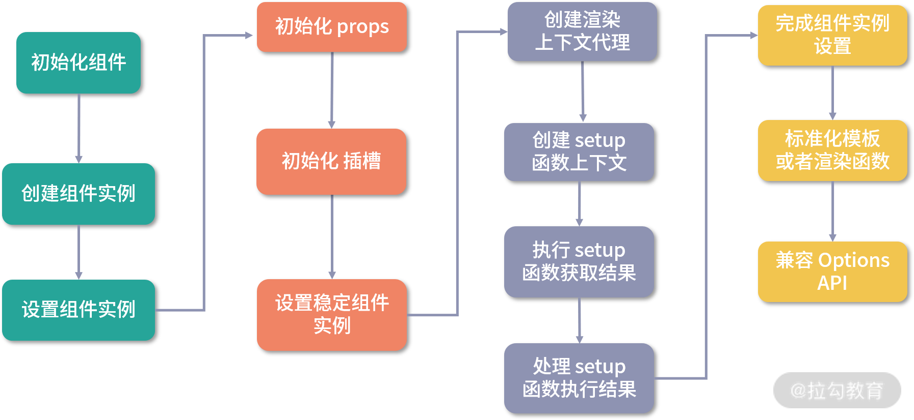

# setup（组件初始化）

vue3新增 <code>setup</code> 配置，是Composition API的入口

```vue
<template>
  <button @click="num++">{{num}}</button>
</template>

<script>
import { ref } from 'vue'

export default {
  setup() {
    const num = ref(0)
    
    return {
      num
    }
  }
}
</script>
```

js的部分也可以这么写

```vue
<script setup lang="ts">
import { ref } from 'vue'

const num = ref(0)
</script>
```

> 我们暂时不考虑这种写法，不利于我们分析源码

在vue2.x编写组件的时候，是在初始化阶段就已经对props、computed、data进行数据拦截，并手动触发获取数据从而收集依赖。那么在vue3中是如何访问到setup函数的返回值，我们接下来重点研究

一个组件的渲染流程是

```txt
创建vnode => 渲染vnode（转化成Dom） => 挂载Dom
```

在组件渲染vnode之前还做了一些处理

```ts
const mountComponent: MountComponentFn = (
    initialVNode,
    container,
    anchor,
    parentComponent,
    parentSuspense,
    isSVG,
    optimized
  ) => {
    const instance: ComponentInternalInstance =
      compatMountInstance ||
      (initialVNode.component = createComponentInstance(
        initialVNode,
        parentComponent,
        parentSuspense
      ))

    setupComponent(instance)

    setupRenderEffect(
      instance,
      initialVNode,
      container,
      anchor,
      parentSuspense,
      isSVG,
      optimized
    )
  }
```

那就是进行了**创建组件实例**、**设置组件实例**、**设置并运行副作用（挂载渲染vnode函数，并运行）**

## 创建组件实例

我们先来分析创建组件实例 <code>createComponentInstance</code> 函数

```ts
export function createComponentInstance(
  vnode: VNode,
  parent: ComponentInternalInstance | null,
  suspense: SuspenseBoundary | null
) {
  const type = vnode.type as ConcreteComponent
  // inherit parent app context - or - if root, adopt from root vnode
  const appContext =
    (parent ? parent.appContext : vnode.appContext) || emptyAppContext

  const instance: ComponentInternalInstance = {
    uid: uid++, // 组件id
    vnode, // 组件vnode
    type, // 组件类型
    parent, // 父组件实例
    appContext, // app上下文
    root: null!, // 根组件实例
    next: null, // 新组件vnode用来更新对比
    subTree: null!, // 子vnode树
    effect: null!, // 响应式相关
    update: null!, // 更新函数
    scope: new EffectScope(true /* detached */),
    render: null, // 模板渲染函数
    proxy: null, // 渲染上下文代理
    exposed: null,
    exposeProxy: null,
    withProxy: null, // 带有with区块的上下文代理
    provides: parent ? parent.provides : Object.create(appContext.provides), // 祖辈组件依赖注入
    accessCache: null!, // 渲染代理属性缓存
    renderCache: [], // 渲染缓存

    // local resolved assets
    components: null, // 该组件上注册的组件
    directives: null, // 该组件上注册的指令

    // resolved props and emits options
    propsOptions: normalizePropsOptions(type, appContext),
    emitsOptions: normalizeEmitsOptions(type, appContext),

    // emit
    emit: null!, // 触发事件方法
    emitted: null, 

    // props default value
    propsDefaults: EMPTY_OBJ,

    // inheritAttrs
    inheritAttrs: type.inheritAttrs,

    // state
    ctx: EMPTY_OBJ, // 渲染上下文
    data: EMPTY_OBJ, // data 数据
    props: EMPTY_OBJ, // props 数据
    attrs: EMPTY_OBJ, // 普通属性
    slots: EMPTY_OBJ, // 插槽
    refs: EMPTY_OBJ, // ref
    setupState: EMPTY_OBJ, // setup函数返回结果
    setupContext: null, // setup函数上下文

    // suspense related suspense组件相关
    suspense,
    suspenseId: suspense ? suspense.pendingId : 0,
    asyncDep: null,
    asyncResolved: false,

    // lifecycle hooks
    // not using enums here because it results in computed properties
    isMounted: false, // 是否已挂载
    isUnmounted: false, // 是否已卸载
    isDeactivated: false, // 是否失活
    bc: null, // beforCreate生命周期
    c: null, // created生命周期
    bm: null, // beforeMount生命周期
    m: null, // mounted生命周期
    bu: null, // beforeUpdate生命周期
    u: null, // updated生命周期
    um: null, // unmounted生命周期
    bum: null, // beforUnmount生命周期
    da: null, // deactivated生命周期
    a: null, // activated生命周期
    rtg: null, // renderTriggered生命周期，仅开发
    rtc: null, // renderTracked生命周期，仅开发
    ec: null, // errorCaptured生命周期
    sp: null // serverPrefetch生命周期
  }
 
  instance.ctx = { _: instance } // 初始化渲染上下文
  instance.root = parent ? parent.root : instance // 赋值根组件实例
  instance.emit = emit.bind(null, instance) // 赋值触发事件函数

  return instance
}
```

组件实例本质就是一个对象，里面有一些组件的方法以及属性。接着就是组件实例的设置流程，通过函数 <code>setupComponent</code> 实现

## 设置组件实例

```ts
export function setupComponent(
  instance: ComponentInternalInstance,
  isSSR = false
) {
  // 服务器渲染相关
  isInSSRComponentSetup = isSSR

  const { props, children } = instance.vnode
  // 判断是否是一个有状态的组件，其实就是组件是否是一个对象
  const isStateful = isStatefulComponent(instance)
  // 初始化props
  initProps(instance, props, isStateful, isSSR)
  // 初始化slots
  initSlots(instance, children)

  // 设置状态组件
  const setupResult = isStateful
    ? setupStatefulComponent(instance, isSSR)
    : undefined
  isInSSRComponentSetup = false
  return setupResult
}
```

<code>setupComponent</code> 函数中进行初始化props和slots，这部分逻辑在后面分析，接着判断如果有状态的组件，则通过 <code>setupStatefulComponent</code> 函数进行进一步处理

```ts
function setupStatefulComponent(
  instance: ComponentInternalInstance,
  isSSR: boolean
) {
  const Component = instance.type as ComponentOptions

  // 创建渲染代理属性缓存
  instance.accessCache = Object.create(null)
  // 创建渲染上下文代理
  instance.proxy = markRaw(new Proxy(instance.ctx, PublicInstanceProxyHandlers))
  // 判断是否存在setup函数
  const { setup } = Component
  if (setup) {
    // 创建setup上下文，前提是setup函数至少有一个参数（也就是使用setup的第一个参数的时候才会创建上下文）
    const setupContext = (instance.setupContext =
      setup.length > 1 ? createSetupContext(instance) : null)

    // 调用setup
    const setupResult = callWithErrorHandling(
      setup,
      instance,
      ErrorCodes.SETUP_FUNCTION,
      [instance.props, setupContext]
    )

    // 判断setup返回值
    if (isPromise(setupResult)) {
      setupResult.then(unsetCurrentInstance, unsetCurrentInstance)
    } else {
      // 处理返回结果
      handleSetupResult(instance, setupResult, isSSR)
    }
  } else {
    // 完成设置组件实例
    finishComponentSetup(instance, isSSR)
  }
}
```

<code>setupStatefulComponent</code> 函数主要做了几件事：创建渲染上下文代理、调用setup函数、处理setup函数返回结果。我们逐个分析

### 创建渲染上下文代理

首先要弄清楚为什么要创建一个代理

```vue
<template>
  <div>{{ msg }}</div>
</template>
<script>
export default {
  data() {
    return {
      msg: 1
    }
  }
}
</script>
```

vue2.x每个组件是一个Vue实例，在获取data或props属性的的时候可以直接通过 <code>this.xxx</code> 获取，实际上这些数据是存放在实例的 <code>_data</code> 和 <code>_props</code> 上的，为了方便使用，vue用Object.defineProperty将其中的属性都挂载到实例上，做了一层代理

同样在vue3的各个类型的数据也是存放在setupState、ctx、data、props中，为了方便使用，所有的访问都在组件实例渲染上下文（ctx）上进行，所以需要对ctx进行代理，将访问的请求分发到各数据存放的位置

代理的配置是 <code>PublicInstanceProxyHandlers</code>，<code>PublicInstanceProxyHandlers</code>配置了get、set、has、defineProperty（暂不研究），我们逐个分析

#### PublicInstanceProxyHandlers.get

```ts
export const PublicInstanceProxyHandlers: ProxyHandler<any> = {
  get({ _: instance }: ComponentRenderContext, key: string) {
    const { ctx, setupState, data, props, accessCache, type, appContext } =
      instance

    let normalizedProps
    // 处理非内部属性 $xxx
    if (key[0] !== '$') {
      // 取缓存数据
      const n = accessCache![key]
      if (n !== undefined) {
        // 判断有缓存，直接取数据
        switch (n) {
          case AccessTypes.SETUP:
            return setupState[key]
          case AccessTypes.DATA:
            return data[key]
          case AccessTypes.CONTEXT:
            return ctx[key]
          case AccessTypes.PROPS:
            return props![key]
          // default: just fallthrough
        }
      } else if (hasSetupBinding(setupState, key)) {
        // 判断如果是setupState的数据，获取数据，存缓存，返回
        accessCache![key] = AccessTypes.SETUP
        return setupState[key]
      } else if (data !== EMPTY_OBJ && hasOwn(data, key)) {
        // 如果是data上的数据，获取数据，存缓存，返回
        accessCache![key] = AccessTypes.DATA
        return data[key]
      } else if (
        // only cache other properties when instance has declared (thus stable)
        // props
        (normalizedProps = instance.propsOptions[0]) &&
        hasOwn(normalizedProps, key)
      ) {
        // 如果是props上的数据，获取数据，存缓存，返回
        accessCache![key] = AccessTypes.PROPS
        return props![key]
      } else if (ctx !== EMPTY_OBJ && hasOwn(ctx, key)) {
        // 如果是ctx上的数据，获取数据，存缓存，返回
        accessCache![key] = AccessTypes.CONTEXT
        return ctx[key]
      }
    }

    const publicGetter = publicPropertiesMap[key]
    let cssModule, globalProperties
    if (publicGetter) {
      // 判断如果是内部属性或方法 $xxx
      if (key === '$attrs') {
        track(instance, TrackOpTypes.GET, key)
      }
      return publicGetter(instance)
    } else if (
      (cssModule = type.__cssModules) &&
      (cssModule = cssModule[key])
    ) {
      // 判断是css模块，通过vue-loader注入
      return cssModule
    } else if (ctx !== EMPTY_OBJ && hasOwn(ctx, key)) {
      // 判断是用户设置的自定义属性，也是$开头
      accessCache![key] = AccessTypes.CONTEXT
      return ctx[key]
    } else if (
      ((globalProperties = appContext.config.globalProperties),
      hasOwn(globalProperties, key))
    ) {
      // 判断是全局属性
      return globalProperties[key]
    }
  },

  set(){
    // ...
  },
  has(){
    // ...
  },
  defineProperty(){
    // ...
  }
}
```

首先是访问非内部属性（非$开头的属性），会根据根据缓存情况去取数据，如果没缓存则取数据并记录缓存。这里的缓存对象 <code>accessCache</code> 非常有意思，只记录了数据名称和数据类型（AccessTypes）的映射，通过 <code>hasOwn</code> 函数遍历对象确认是否存在该属性的性能相对低下，而直接对象数据访问（obj\[key]）获取数据性能更好，缓存对象 <code>accessCache</code> 只需要记录该数据的类型即可，重复访问可以直接根据缓存的数据类型去对应的对象中取数据

> 访问非内部属性的顺序为 setupState > data > ctx > props

之后如果是内部属性或方法（$开头），会依次判断内部属性或方法、css模块、自定义属性、全局属性，并返回对应值

#### PublicInstanceProxyHandlers.set

```ts
export const PublicInstanceProxyHandlers: ProxyHandler<any> = {
  get() {
    // ...
  },

  set(
    { _: instance }: ComponentRenderContext,
    key: string,
    value: any
  ): boolean {
    const { data, setupState, ctx } = instance
    // 如果是setupState、data属性直接设置，如果是props则不能设置
    if (hasSetupBinding(setupState, key)) {
      setupState[key] = value
      return true
    } else if (data !== EMPTY_OBJ && hasOwn(data, key)) {
      data[key] = value
      return true
    } else if (hasOwn(instance.props, key)) {
      return false
    }
    
    // 如果是内部属性 $xxx 不能设置，否则设置渲染上下文中的数据
    if (key[0] === '$' && key.slice(1) in instance) {
      return false
    } else {
      ctx[key] = value
    }
    return true
  },

  has() {
    // ...
  },

  defineProperty() {
    // ...
  }
}
```

<code>set</code> 配置逻辑比较简单，对一些属性赋值进行了限制。如果是setupState、data属性可以进行赋值，如果是内部属性则不能复制，如果以上情况都不是则给渲染上下文赋值（ctx）

这里渲染上下文赋值的情况属于setup函数没有返回该属性、data中没有配置该属性、props中也没有该属性，例如：

```ts
export default {
  created() {
    this.data = 'data'
  }
}
```

> 可赋值属性顺序 setupState > data > ctx

#### PublicInstanceProxyHandlers.has

```ts
export const PublicInstanceProxyHandlers: ProxyHandler<any> = {
  get() {
    // ...
  },

  set() {
    // ...
  },

  has(
    {
      _: { data, setupState, accessCache, ctx, appContext, propsOptions }
    }: ComponentRenderContext,
    key: string
  ) {
    let normalizedProps
    return (
      !!accessCache![key] ||
      (data !== EMPTY_OBJ && hasOwn(data, key)) ||
      hasSetupBinding(setupState, key) ||
      ((normalizedProps = propsOptions[0]) && hasOwn(normalizedProps, key)) ||
      hasOwn(ctx, key) ||
      hasOwn(publicPropertiesMap, key) ||
      hasOwn(appContext.config.globalProperties, key)
    )
  },

  defineProperty() {
    // ...
  }
}
```

<code>has</code>，方法就是在遍历的时候按照一定顺序判断是否存在某值：渲染属性缓存（accessCache） > data > setupState > props > 渲染上下文（ctx） > 内部属性$xxx > 全局属性

### 调用setup函数

数据存放在组件实例的各个属性下，渲染上下文代理实际上是将这些属性代理到渲染上下文（cxt）中，统一数据访问入口。接着回到 <code>setupStatefulComponent</code> 函数中

```ts
// 判断是否存在setup函数
const { setup } = Component
if (setup) {
  // 创建setup上下文，前提是setup函数至少有一个参数（也就是使用setup的第一个参数的时候才会创建上下文）
  const setupContext = (instance.setupContext =
    setup.length > 1 ? createSetupContext(instance) : null)

  // 调用setup
  const setupResult = callWithErrorHandling(
    setup,
    instance,
    ErrorCodes.SETUP_FUNCTION,
    [instance.props, setupContext]
  )

  // ...
}
```

首先根据setup函数参数判断是否需要创建setup上下文，意思如下：

```vue
<template>
  <div>{{ data }}</div>
  <button @click="onClick">click</button>
</template>
<script>
  export default {
    props: {
      data: String
    },
    setup (props, { emit }) {
      function onClick () {
        emit('onClick', props.data)
      }

      return {
        onClick
      }
    }
  }
</script>
```

如上面例子，<code>setup</code> 接收了两个参数，第一个是props，第二个就是setup上下文。具体setup上下文的实现在 <code>createSetupContext</code> 函数中

```ts
export function createSetupContext(
  instance: ComponentInternalInstance
): SetupContext {
  const expose: SetupContext['expose'] = exposed => {
    instance.exposed = exposed || {}
  }

  let attrs: Data
  return {
    get attrs() {
      return attrs || (attrs = createAttrsProxy(instance))
    },
    slots: instance.slots,
    emit: instance.emit,
    expose
  }
}
```

可以看到setup上下文就是对组件实例上部分属性进行了封装，实际上调用方法或操作数据还是在组件实例上

接着我们回到 <code>setupStatefulComponent</code> 函数中继续分析，执行setup函数是通过 <code>callWithErrorHandling</code> 函数调用

```ts
const setupResult = callWithErrorHandling(
  setup,
  instance,
  ErrorCodes.SETUP_FUNCTION,
  [instance.props, setupContext]
)

export function callWithErrorHandling(
  fn: Function,
  instance: ComponentInternalInstance | null,
  type: ErrorTypes,
  args?: unknown[]
) {
  let res
  try {
    res = args ? fn(...args) : fn()
  } catch (err) {
    handleError(err, instance, type)
  }
  return res
}
```

<code>callWithErrorHandling</code> 函数只是执行了传入函数，并处理报错。可以看到setup函数的第一第二参数就是 <code>callWithErrorHandling</code> 函数传入的 <code>\[instance.props, setupContext]</code>


### 处理setup函数返回结果

调用setup的逻辑就是获取使用setup函数参数情况进行参数构建，并调用setup函数将构建好的参数传入，获得setup函数的返回值 <code>setupResult</code>。我们再次回到 <code>setupStatefulComponent</code> 函数看如何处理setup返回结果 <code>setupResult</code>

```ts
handleSetupResult(instance, setupResult, isSSR)
```

通过 <code>handleSetupResult</code> 函数处理 <code>setupResult</code>

```ts
export function handleSetupResult(
  instance: ComponentInternalInstance,
  setupResult: unknown,
  isSSR: boolean
) {
  if (isFunction(setupResult)) {
    // 判断是渲染函数
    instance.render = setupResult as InternalRenderFunction
  } else if (isObject(setupResult)) {
    // 判断是对象，将返回值转化成响应式
    instance.setupState = proxyRefs(setupResult)
  }
  // 完成组件实例设置
  finishComponentSetup(instance, isSSR)
}
```

<code>handleSetupResult</code> 函数根据 <code>setupResult</code>（setup函数返回值）的类型做不同处理，如果是函数则认为是渲染函数挂载到组件实例上（setup可以返回一个渲染函数），如果是对象则转化成响应式挂载到组件实例，这样setup函数和当前组件就关联上了。最后调用 <code>finishComponentSetup</code> 完成组件实例的设置

```ts
export function finishComponentSetup(
  instance: ComponentInternalInstance,
  isSSR: boolean,
  skipOptions?: boolean
) {
  const Component = instance.type as ComponentOptions

  if (!instance.render) {
    // 判断组件实例上没有render函数
    if (!isSSR && compile && !Component.render) {
      // 不是服务器渲染，且使用了runtime-only版本，且该组件没有render函数

      // 获取模板
      const template =
        (__COMPAT__ &&
          instance.vnode.props &&
          instance.vnode.props['inline-template']) ||
        Component.template ||
        resolveMergedOptions(instance).template
      if (template) {
        // 根据组件配置和组件模板生成render函数

        // 这里配置优先级是 组件配置 > 全局配置
        const { isCustomElement, compilerOptions } = instance.appContext.config
        const { delimiters, compilerOptions: componentCompilerOptions } =
          Component
        const finalCompilerOptions: CompilerOptions = extend(
          extend(
            {
              isCustomElement,
              delimiters
            },
            compilerOptions
          ),
          componentCompilerOptions
        )

        // 生成render函数
        Component.render = compile(template, finalCompilerOptions)
      }
    }

    // 组件实例的render函数就是组件的render函数
    instance.render = (Component.render || NOOP) as InternalRenderFunction

    // 对使用with块，使用新的上下文代理
    if (installWithProxy) {
      installWithProxy(instance)
    }
  }
}
```

<code>finishComponentSetup</code> 函数主要作用在于，根据组件配置和组件模板生成该组件的render函数，并挂在至组件实例上

## 总结

这章主要分析组件在渲染vnode之前的逻辑，首先需要创建组件实例，接着设置组件实例。在设置组件实例中了解为什么需要渲染上下文代理以及创建逻辑，了解之后调用setup函数时机以及参数生成，以及最后处理setup函数的返回值并生成该组件的render函数挂载至属性实例上



## 附加

### runtime-only和runtime-compiled版本

vue组件最终是通过render函数生成的vnode树，render是代码中编写的模板编译生成，如果项目是用webpack构建，可以通过vue-loader将模板编译生成render。如果直接引入vue使用，vue本身也自带编译函数compile进行编译模板

这也就是为什么有runtime-only和runtime-compiled版本，区别在于是否有compile函数。如果项目使用webpack + vue-loader构建，建议使用runtime-only版本减少打包体积。如果项目直接引入vue则需要使用runtime-compiled版本

vue3的compile方法是通过函数注册的

```ts
let compile: CompileFunction | undefined

export function registerRuntimeCompiler(_compile: any) {
  compile = _compile
}
```


### 为什么调用setup需要通过callWithErrorHandling函数

我们进入该函数内部查看

```ts
export function callWithErrorHandling(
  fn: Function,
  instance: ComponentInternalInstance | null,
  type: ErrorTypes,
  args?: unknown[]
) {
  let res
  try {
    res = args ? fn(...args) : fn()
  } catch (err) {
    handleError(err, instance, type)
  }
  return res
}
```

如果setup函数报错，这里进入 <code>handleError</code> 函数处理

```ts
export function handleError(
  err: unknown,
  instance: ComponentInternalInstance | null,
  type: ErrorTypes,
  throwInDev = true
) {
  const contextVNode = instance ? instance.vnode : null
  if (instance) {
    // 从当前组件向上冒泡，触发父组件、祖父组件的errorCaptured生命周期，直到根组件
    let cur = instance.parent
    const exposedInstance = instance.proxy
    const errorInfo = type
    while (cur) {
      const errorCapturedHooks = cur.ec
      if (errorCapturedHooks) {
        for (let i = 0; i < errorCapturedHooks.length; i++) {
          if (errorCapturedHooks[i](err, exposedInstance, errorInfo) === false) {
            return
          }
        }
      }
      cur = cur.parent
    }
    // 调用全局配置的errorHandler函数
    const appErrorHandler = instance.appContext.config.errorHandler
    if (appErrorHandler) {
      callWithErrorHandling(
        appErrorHandler,
        null,
        ErrorCodes.APP_ERROR_HANDLER,
        [err, exposedInstance, errorInfo]
      )
      return
    }
  }
  // 记录错误信息
  logError(err, type, contextVNode, throwInDev)
}
```

<code>handleError</code> 函数将错误向上冒泡，调用父级组件的errorCaptured生命周期直到根组件，之后调用全局配置的errorHandler函数，最后记录错误