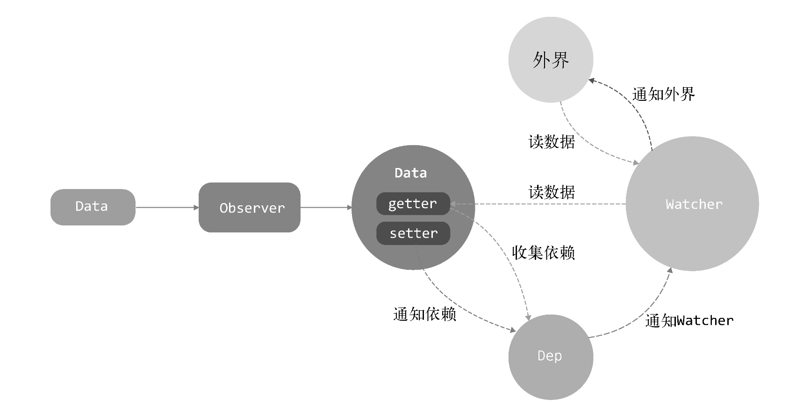

# 响应式

响应式是vue的一大核心思想，在数据更新的时候自动更新视图，先回顾一下vue2.x的响应式是如何实现的



在init阶段对data配置进行初始化，将data转化为可观察对象（Observer），在可观察对象的getter函数中使用dep收集依赖watcher，在setter函数中通知dep中的watcher更新。之后再mount阶段创建watcher的时候对data中的对象进行手动访问，从而触发依赖收集

其中dep就是一个依赖收集器，用来收集依赖也就是监听者watcher，而watcher就是用来通知更新的，实际上watcher上记录着当前的vue实例，触发更新也是vue实例的更新

可观察对象的内部是使用 <code>Object.defineProperty</code> 实现的，通过数据劫持实现收集和更新数据时使用dep通知依赖watcher更新视图，<code>Object.defineProperty</code> 也有一些缺点，因为是对象属性的监听，所以无法监听到对象的增加和删除，初始化递归全部data数据也有一些性能提升的空间

vue3为了解决 <code>Object.defineProperty</code> 这些问题，选用 <code>Proxy</code> 重写了响应式的部分，并将响应式的代码都放在reactivity库下

## Reactive API

vue2.x响应式的前提是需要将数据定义在data中，如果直接向vue实例添加属性是不会有响应式的，前面也说到响应式是在init阶段对data进行的处理，之所以可以直接通过实例访问data的数据，是因为vue2.x将data的属性都代理到了vue实例上

```vue
<script>
  export default {
    data() {
      return {
        test1: "test1"
      }
    },

    created(){
        this.test2 = "test2"
    },
    
    methods: {
      setTest() {
        this.test1 = "test111"
        this.test2 = "test222"
      }
    }
  }
</script>
```

<code>test2</code> 因为直接定义在vue实例上，所以在 <code>setTest</code> 函数中修改是不会有响应式的。响应式会牺牲性能，如果有些数据为常量，并不希望有响应式，那么可以这么做

vue3通过Reactive API实现响应式

```vue
<script>
  import { reactive } from 'vue'
  export default {
    setup() {
      const data = reactive({
        test: 'test'
      })

      function setDataTest() {
        data.test = "new test"
      }

      return {
        setDataTest,
        data
      }
    }
  }
</script>
```

vue3通过 <code>setup</code> 和 <code>reactive</code> 函数实现了和vue2.x同样的效果。我们之前分析过setup的流程，在mount阶段设置组件实例的时候会触发setup函数，并将返回值挂载到组件实例上，因此响应式的功能是由reactive函数完成的，我们直接分析reactive函数源码

```ts
// 代理缓存
export const reactiveMap = new WeakMap<Target, any>()
export function reactive(target: object) {
  // 如果是只读则直接返回
  if (isReadonly(target)) {
    return target
  }
  // 创建响应式对象
  return createReactiveObject(
    target,
    false,
    mutableHandlers,
    mutableCollectionHandlers,
    reactiveMap
  )
}

function createReactiveObject(
  target: Target,
  isReadonly: boolean,
  baseHandlers: ProxyHandler<any>,
  collectionHandlers: ProxyHandler<any>,
  proxyMap: WeakMap<Target, any>
) {
  // reactive方法必须接受一个对象或数组类型即 typeof target === 'object'
  if (!isObject(target)) {
    return target
  }

  if (
    target[ReactiveFlags.RAW] &&
    !(isReadonly && target[ReactiveFlags.IS_REACTIVE])
  ) {
    // 如果已经是一个响应式对象直接返回，除了该响应式对象是只读的，因为只读需要对getter做处理
    return target
  }

  // 判断传入对象是否在代理缓存中，如果存在直接返回  
  const existingProxy = proxyMap.get(target)
  if (existingProxy) {
    return existingProxy
  }
  // 获取传入对象类型，INVALID表示数据不可拓展（不能添加新属性），COLLECTION表示数据为Map、Set类型
  const targetType = getTargetType(target)
  if (targetType === TargetType.INVALID) {
    // 这里如果传入数据是不可拓展的类型则直接返回
    return target
  }
  // 创建传入对象的代理，根据传入对象的类型选用不同的配置
  const proxy = new Proxy(
    target,
    targetType === TargetType.COLLECTION ? collectionHandlers : baseHandlers
  )
  // 记入缓存
  proxyMap.set(target, proxy)
  return proxy
}
```

<code>reactive</code> 函数是对只读数据进行了判断，响应式的核心是 <code>createReactiveObject</code> 函数处理的，该函数有几个重要逻辑
- 判断一些不需要进行代理的分支情况，直接返回传入数据。或是命中缓存，返回缓存的数据代理
- 创建数据的代理，根据数据类型选用配置
- 记入缓存

当传入数据类型是(Weak)Map或(Weak)Set时会使用 <code>collectionHandlers</code> 配置，我们暂时不考虑该情况，如果传入一个普通的数组或对象则使用 <code>baseHandlers</code> 配置，也就是 <code>mutableHandlers</code>，接下来就分析其配置

## mutableHandlers配置

```ts
export const mutableHandlers: ProxyHandler<object> = {
  get,
  set,
  deleteProperty,
  has,
  ownKeys
}
```

<code>mutableHandlers</code> 配置了很多属性，对获取（get）、设置（set）、删除（deleteProperty）、in操作符（has）、Object.getOwnPropertyNames（ownKeys）行为进行了代理，在触发这些行为时无非做了收集依赖、派发更新、清除依赖这三个事的其中一种，我们需要重点分析get、set

## 在get函数中实现依赖收集

```ts
const get = /*#__PURE__*/ createGetter()

function createGetter(isReadonly = false, shallow = false) {
  return function get(target: Target, key: string | symbol, receiver: object) {
    // 处理该数据的描述属性
    if (key === ReactiveFlags.IS_REACTIVE) {
      // 是否是响应式
      return !isReadonly
    } else if (key === ReactiveFlags.IS_READONLY) {
      // 是否是只读，这里的只读和响应式是互斥的
      return isReadonly
    } else if (key === ReactiveFlags.IS_SHALLOW) {
      // 是否是浅响应式
      return shallow
    } else if (
      key === ReactiveFlags.RAW &&
      receiver ===
        (isReadonly
          ? shallow
            ? shallowReadonlyMap
            : readonlyMap
          : shallow
          ? shallowReactiveMap
          : reactiveMap
        ).get(target)
    ) {
      // 是否是原生数据（就是被代理的数据）
      return target
    }

    // 判断是否为数组
    const targetIsArray = isArray(target)

    if (!isReadonly) {
      if (targetIsArray && hasOwn(arrayInstrumentations, key)) {
        // 如果访问的属性是非只读且是部分数组方法时直接返回该方法
        // 'includes', 'indexOf', 'lastIndexOf', 'push', 'pop', 'shift', 'unshift', 'splice'
        return Reflect.get(arrayInstrumentations, key, receiver)
      }
      // 处理数组方法后改写hasOwnProperty方法，因为hasOwn内部是使用hasOwnProperty方法实现
      if (key === 'hasOwnProperty') {
        // 该数据是非只读且访问hasOwnProperty方法时返回封装后的该方法
        return hasOwnProperty
      }
    }

    // 获取访问属性的值
    const res = Reflect.get(target, key, receiver)
    
    if (isSymbol(key) ? builtInSymbols.has(key) : isNonTrackableKeys(key)) {
      // 如果访问的是内置的symbol key 或是 __proto__、__v_isRef、__isVue属性则直接返回
      return res
    }

    if (!isReadonly) {
      // 如果不是只读属性则进行依赖收集
      track(target, TrackOpTypes.GET, key)
    }

    if (shallow) {
      // 如果是浅响应式在收集依赖后直接返回
      return res
    }

    if (isRef(res)) {
      // 如果访问的值是ref有两种处理情况，如果值是数组返回值，如果值非数组返回
      return targetIsArray && isIntegerKey(key) ? res : res.value
    }

    if (isObject(res)) {
      // 如果是对象有两个处理情况，如果是只读则走只读逻辑，否则递归访问属性的值进行依赖收集
      return isReadonly ? readonly(res) : reactive(res)
    }

    return res
  }
}
```

<code>get</code> 是通过 <code>createGetter</code> 函数获得，因为readonly、shallowReactive等API也需要get函数

<code>get</code> 函数的几个主要逻辑
- 处理内置的一些对数据描述的属性
- 处理数组方法直接返回，之后重写hasOwnProperty方法
- 收集依赖
- 判断是否是浅响应或ref，直接返回对应值，其中ref结构返回
- 如果是对象、数组、map、set递归子属性

至此整个get函数就分析完了，本质就是递归子属性进行依赖收集，当代理数据被访问的时候才会递归收集子属性依赖，这里对比vue2.x的在初始化中递归所有属性收集依赖的性能有所提升。其中一些数组方法放置在 <code>arrayInstrumentations</code> 中进行处理，而收集依赖在函数 <code>track</code> 中，我们依次分析

### arrayInstrumentations 封装数组方法

```ts
const arrayInstrumentations = /*#__PURE__*/ createArrayInstrumentations()

function createArrayInstrumentations() {
  const instrumentations: Record<string, Function> = {}
  
  (['includes', 'indexOf', 'lastIndexOf'] as const).forEach(key => {
    // 对'includes', 'indexOf', 'lastIndexOf'三个方法进行封装
    instrumentations[key] = function (this: unknown[], ...args: unknown[]) {
      // 获取代理前的数据
      const arr = toRaw(this) as any
      for (let i = 0, l = this.length; i < l; i++) {
        // 遍历数组收集依赖
        track(arr, TrackOpTypes.GET, i + '')
      }
      // 调用数组原生方法将参数透传获得结果
      const res = arr[key](...args)
      if (res === -1 || res === false) {
        // 因为调用数组方法传入的可能是一个值的代理，如果没有找到该值则使用toRaw获取代理前的值重新调用方法
        return arr[key](...args.map(toRaw))
      } else {
        return res
      }
    }
  })
  
  // 对'push', 'pop', 'shift', 'unshift', 'splice'方法进行封装，在调用期间暂停跟踪
  (['push', 'pop', 'shift', 'unshift', 'splice'] as const).forEach(key => {
    instrumentations[key] = function (this: unknown[], ...args: unknown[]) {
      pauseTracking()
      const res = (toRaw(this) as any)[key].apply(this, args)
      resetTracking()
      return res
    }
  })
  return instrumentations
}
```

<code>arrayInstrumentations</code> 是调用 <code>createArrayInstrumentations</code> 函数返回的结果，函数内部对一些数组方法进行封装，如果修改了数组中某个元素，includes、indexOf、lastIndexOf方法的结果可能会发生变化，这里需要对数组每一项进行依赖收集。后面的push等方法重写是为了防止修改数组长度产生的问题，这里不研究

### track 依赖收集

```ts
// 是否追踪依赖
export let shouldTrack = true
// 当前副作用函数
export let activeEffect: ReactiveEffect | undefined

export function track(target: object, type: TrackOpTypes, key: unknown) {
  if (shouldTrack && activeEffect) {
    // 从targetMap表中取出依赖收集器表depsMap，如果没有则创建一个
    let depsMap = targetMap.get(target)
    if (!depsMap) {
      targetMap.set(target, (depsMap = new Map()))
    }
    // 获取收集器表depsMap中对应key的收集器，如果没有则创建一个
    let dep = depsMap.get(key)
    if (!dep) {
      depsMap.set(key, (dep = createDep()))
    }

    trackEffects(dep)
  }
}

export function trackEffects(
  dep: Dep
) {
  if (!dep.has(activeEffect!)) {
    // 收集器中不存在当前副作用后添加该副作用
    dep.add(activeEffect!)
    // 副作用也记录依赖收集器
    activeEffect!.deps.push(dep)
  }
}
```

<code>shouldTrack</code> 是某些场景下不进行依赖收集，<code>activeEffect</code> 就是当前副作用函数，这里建立了一个 数据（target）=> 数据属性（key） => 收集器（dep）的依赖关系，之后调用 <code>trackEffects</code> 函数添加依赖，将当前副作用添加至收集器中，并且当前副作用也添加了收集器，此时targetMap的结构如下

```ts
{
  target: {
    key: [ 
      effect as ReactiveEffect
    ] as dep
  } as depsMap
} as targetMap
```

## 在set函数中实现派发更新

```ts
const set = /*#__PURE__*/ createSetter()

function createSetter(shallow = false) {
  return function set(
    target: object,
    key: string | symbol,
    value: unknown,
    receiver: object
  ): boolean {
    // 取出旧值
    let oldValue = (target as any)[key]
    if (isReadonly(oldValue) && isRef(oldValue) && !isRef(value)) {
      // 当旧值是只读且是ref，并且新值不是ref不能赋值
      return false
    }
    if (!shallow) {
      // 非浅代理
      if (!isShallow(value) && !isReadonly(value)) {
        // 新值非浅代理且非只读，取出新旧值代理前的原值
        oldValue = toRaw(oldValue)
        value = toRaw(value)
      }
      if (!isArray(target) && isRef(oldValue) && !isRef(value)) {
        // 代理数据为非数组，且旧值是ref，且新值不是ref，将新值赋值旧值
        oldValue.value = value
        return true
      }
    } else {
      // in shallow mode, objects are set as-is regardless of reactive or not
    }

    // 判断这个key是否存在，这里分target是数组或对象两种情况
    const hadKey =
      isArray(target) && isIntegerKey(key)
        ? Number(key) < target.length
        : hasOwn(target, key)
    // 设置数据属性
    const result = Reflect.set(target, key, value, receiver)
    if (target === toRaw(receiver)) {
      // receiver是最初被调用的对象，如果数据原型链上有一个proxy，那么数据在赋值时该proxy也会触发set
      // 这里是过滤掉数据原型链上的proxy

      // 根据key是否存在调用派发更新函数传入不同参数
      if (!hadKey) {
        trigger(target, TriggerOpTypes.ADD, key, value)
      } else if (hasChanged(value, oldValue)) {
        trigger(target, TriggerOpTypes.SET, key, value, oldValue)
      }
    }
    return result
  }
}
```

<code>set</code> 函数主要是处理赋值，其中有两个重要逻辑
- 判断不能赋值的情况。之后标准化新旧值后进行赋值
- 派发更新逻辑，根据key是否存在走不同逻辑的派发更新

派发更新的逻辑在 <code>trigger</code> 函数中

```ts
export function trigger(
  target: object,
  type: TriggerOpTypes,
  key?: unknown,
  newValue?: unknown,
  oldValue?: unknown,
  oldTarget?: Map<unknown, unknown> | Set<unknown>
) {
  // 在get中已经将数据缓存在targetMap上，这里将对应的收集器map取出来
  const depsMap = targetMap.get(target)
  if (!depsMap) {
    // 没有依赖，结束
    return
  }

  // 需要更新的依赖队列
  let deps: (Dep | undefined)[] = []
  if (type === TriggerOpTypes.CLEAR) {
    // 清除收集，将所有依赖放入更新队列
    deps = [...depsMap.values()]
  } else if (key === 'length' && isArray(target)) {
    // 如果通过下标修改数组类型的数据
    const newLength = Number(newValue)
    // 将设置下标之后所有数据的依赖放入更新队列，还有length
    // 例如：[1, 2, 更新下标放入更新队列, 后续的数据放入更新队列]
    depsMap.forEach((dep, key) => {
      if (key === 'length' || key >= newLength) {
        deps.push(dep)
      }
    })
  } else {
    // type 只有这三种情况 SET | ADD | DELETE
    if (key !== void 0) {
      // 如果key有值，取出key对应的依赖[effect, effect, ...]
      deps.push(depsMap.get(key))
    }
  }

  // 将deps队列拍平
  const effects: ReactiveEffect[] = []
  for (const dep of deps) {
    if (dep) {
      effects.push(...dep)
    }
  }
  // 派发更新
  triggerEffects(createDep(effects))
}
```

<code>trigger</code> 函数的主要处理副作用函数，最终目的将副作用函数收集到一个列表中等待执行
- 取出数据对应的依赖地图（key => effect），如果找不到对应的depsMap则认为没有依赖直接结束
- 根据数据的类型将key命中的依赖都收集到更新队列中
- 调用 <code>triggerEffects</code> 函数执行队列

```ts
export function triggerEffects(
  dep: Dep | ReactiveEffect[],
  debuggerEventExtraInfo?: DebuggerEventExtraInfo
) {
  // spread into array for stabilization
  const effects = isArray(dep) ? dep : [...dep]
  for (const effect of effects) {
    triggerEffect(effect, debuggerEventExtraInfo)
  }
}

function triggerEffect(
  effect: ReactiveEffect,
  debuggerEventExtraInfo?: DebuggerEventExtraInfo
) {
  if (effect !== activeEffect || effect.allowRecurse) {
    effect.run()
  }
}
```

最终遍历更新队列，调用每个副作用函数的 <code>run</code> 方法实现更新

## 副作用函数

<code>patch</code> 函数的组件挂载流程中设置了副作用函数，在 <code>setupRenderEffect</code> 函数中

```ts
const setupRenderEffect: SetupRenderEffectFn = (
    instance,
    initialVNode,
    container,
    anchor,
    parentSuspense,
    isSVG,
    optimized
  ) => {
    const componentUpdateFn = () => {
      // ...
    }

    // 副作用函数
    const effect = (instance.effect = new ReactiveEffect(
      componentUpdateFn,
      () => queueJob(update),
      instance.scope // track it in component's effect scope
    ))

    const update: SchedulerJob = (instance.update = () => effect.run())

    update()
  }
```

可见副作用函数就是 <code>ReactiveEffect</code> 类的实例，该实例中有一个run方法

```ts
export class ReactiveEffect<T = any> {
  // ...

  run() {
    if (!this.active) {
      return this.fn()
    }
    let parent: ReactiveEffect | undefined = activeEffect
    let lastShouldTrack = shouldTrack
    while (parent) {
      if (parent === this) {
        return
      }
      parent = parent.parent
    }
    try {
      // 缓存之前的副作用实例
      this.parent = activeEffect
      // 缓存当前副作用实例
      activeEffect = this
      shouldTrack = true

      // 记录递归深度
      trackOpBit = 1 << ++effectTrackDepth

      // 在渲染更新前需要对旧的依赖做处理，例如：旧视图中引用数据a，新视图中引用的数据a变为b，那么需要删除a的依赖，重新添加b的依赖，防止数据a更新后产生额外的渲染开销
      if (effectTrackDepth <= maxMarkerBits) {
        // 如果组件嵌套层数嵌套少于30层，设置deps每个dep.w为已收集
        initDepMarkers(this)
      } else {
        // 清除该副作用中的依赖（dep）
        cleanupEffect(this)
      }
      // 执行副作用函数，如果组件中嵌套组件
      // 如果组件嵌套情况则会再次出发run方法进行递归
      return this.fn()
    } finally {
      if (effectTrackDepth <= maxMarkerBits) {
        // 判断当前副作用的dep中的依赖如果已经收集但是新依赖没有则进行删除
        finalizeDepMarkers(this)
      }

      // 递归完成回到上级
      trackOpBit = 1 << --effectTrackDepth

      // 递归完成将状态回退到上一次递归的状态
      activeEffect = this.parent
      shouldTrack = lastShouldTrack
      this.parent = undefined

      if (this.deferStop) {
        this.stop()
      }
    }
  }

  // ...
}
```

<code>run</code> 方法会调用真正的副作用函数，但是在这之前需要处理一些依赖情况
- 记录当前副作用实例
- 清空依赖（当视图更新依赖变更时，如果不清空依赖可能会造成额外的渲染开销）
- 调用副作用函数（其中会触发render从而触发响应式数据的getter从而收集依赖）走patch流程
- 当副作用函数调用完毕将当前的副作用函数恢复之前的状态

副作用函数在组件嵌套的情况下会递归调用 <code>run</code> 方法，因此需要每一次递归都要记录当前的副作用实例，在递归完成后将当前的副作用实例回退

<code>initDepMarkers</code> 和 <code>finalizeDepMarkers</code> 这里的逻辑是对清空依赖的逻辑进行优化，每次更新视图都需要清空依赖，后再副作用函数中在添加依赖，如果更新视图没有依赖变化，这样就有很多额外的开销，因此 <code>initDepMarkers</code> 函数将现有的依赖收集器（dep）进行标记，然后执行副作用函数进行依赖收集（标记的收集器跳过收集），之后通过 <code>finalizeDepMarkers</code> 函数删除更新后没有的依赖，并删除收集器的标记

<code>effectTrackDepth</code> 是记录组件嵌套层数，<code>maxMarkerBits</code> 是组件最大嵌套层数，如果组件层数大于这个最大嵌套层数则直接清空依赖，如果组件嵌套过深则清空依赖反而性能更好，默认为30

在调用 <code>trackEffects</code> 函数收集依赖的时候也会对标记的依赖不进行收集

```ts
export function trackEffects(
  dep: Dep,
  debuggerEventExtraInfo?: DebuggerEventExtraInfo
) {
  let shouldTrack = false
  if (effectTrackDepth <= maxMarkerBits) {
    if (!newTracked(dep)) {
      // 如果该收集器是一个旧收集器，也就是被标记的
      dep.n |= trackOpBit // set newly tracked
      // 判断该依赖是否需要被收集
      shouldTrack = !wasTracked(dep)
    }
  } else {
    // Full cleanup mode.
    shouldTrack = !dep.has(activeEffect!)
  }

  if (shouldTrack) {
    dep.add(activeEffect!)
    activeEffect!.deps.push(dep)
  }
}
```

<code>trackEffects</code> 函数对收集器做了是否需要收集的判断

## Readonly API

使用 <code>readonly</code> 函数传入一个对象或响应式对象，会给传入对象增加只读限制。我们从入口分析其实现

```ts
export function readonly<T extends object>(
  target: T
): DeepReadonly<UnwrapNestedRefs<T>> {
  return createReactiveObject(target, true, readonlyHandlers, readonlyCollectionHandlers, readonlyMap)
}

function createReactiveObject(
  target: Target,
  isReadonly: boolean,
  baseHandlers: ProxyHandler<any>,
  collectionHandlers: ProxyHandler<any>,
  proxyMap: WeakMap<Target, any>
) {
  // reactive方法必须接受一个对象或数组类型即 typeof target === 'object'
  if (!isObject(target)) {
    return target
  }
  
  if (
    target[ReactiveFlags.RAW] &&
    !(isReadonly && target[ReactiveFlags.IS_REACTIVE])
  ) {
    // 如果已经是一个响应式对象直接返回，除了该响应式对象是只读的，因为只读需要对getter做处理
    return target
  }
  // 判断传入对象是否在代理缓存中，如果存在直接返回  
  const existingProxy = proxyMap.get(target)
  if (existingProxy) {
    return existingProxy
  }
  // 获取传入对象类型，INVALID表示数据不可拓展（不能添加新属性），COLLECTION表示数据为Map、Set类型
  const targetType = getTargetType(target)
  if (targetType === TargetType.INVALID) {
    // 这里如果传入数据是不可拓展的类型则直接返回
    return target
  }
  // 创建传入对象的代理，根据传入对象的类型选用不同的配置
  const proxy = new Proxy(
    target,
    targetType === TargetType.COLLECTION ? collectionHandlers : baseHandlers
  )
  // 记入缓存
  proxyMap.set(target, proxy)
  return proxy
}
```

<code>createReactiveObject</code> 函数的 <code>isReadonly</code> 参数只是在传入响应式对象且需要配置只读的时候走代理逻辑

和 <code>Reactive API</code> 不同的是传入的代理配置不一样，我们只分析普通对象数组的配置，也就是 <code>baseHandlers</code> 参数，<code>Reactive API</code> 传入的是 <code>mutableHandlers</code> 配置，而 <code>Readonly API</code> 传入的是 <code>readonlyHandlers</code> 配置

```ts
export const readonlyHandlers: ProxyHandler<object> = {
  // readonly不需要收集依赖，所以只有get、set、deleteProerty设置
  // 其中set、deleteProerty并没有操作对象
  get: readonlyGet,
  set(target, key) {
    return true
  },
  deleteProperty(target, key) {
    return true
  }
}
```

因为 <code>readonly</code> 是只读的无法赋值，所以不需要收集依赖，也就不需要重写 <code>has</code>、<code>ownkeys</code> 配置

因为无法赋值这里 <code>set</code>、<code>deleteProperty</code> 并没有操作 <code>target</code>

<code>get</code> 配置是从 <code>readonlyGet</code> 变量获得，我们重点分析

```ts
const readonlyGet = createGetter(true)

function createGetter(isReadonly = false, shallow = false) {
  return function get(target: Target, key: string | symbol, receiver: object) {
    // 处理该数据的描述属性
    if (key === ReactiveFlags.IS_REACTIVE) {
      // 是否是响应式
      return !isReadonly
    } else if (key === ReactiveFlags.IS_READONLY) {
      // 是否是只读，这里的只读和响应式是互斥的
      return isReadonly
    } else if (key === ReactiveFlags.IS_SHALLOW) {
      // 是否是浅响应式
      return shallow
    } else if (
      key === ReactiveFlags.RAW &&
      receiver ===
        (isReadonly
          ? shallow
            ? shallowReadonlyMap
            : readonlyMap
          : shallow
          ? shallowReactiveMap
          : reactiveMap
        ).get(target)
    ) {
      // 是否是原生数据（就是被代理的数据）
      return target
    }

    // 判断是否为数组
    const targetIsArray = isArray(target)

    if (!isReadonly) {
      // 重写一些数组相关方法，用于收集依赖
    }

    // 获取访问属性的值
    const res = Reflect.get(target, key, receiver)

    if (isSymbol(key) ? builtInSymbols.has(key) : isNonTrackableKeys(key)) {
      // 如果访问的是内置的symbol key 或是 __proto__、__v_isRef、__isVue属性则直接返回
      return res
    }

    if (!isReadonly) {
      // 如果不是只读属性则进行依赖收集
      track(target, TrackOpTypes.GET, key)
    }


    if (isObject(res)) {
      // 如果是对象有两个处理情况，如果是只读则走只读逻辑，否则递归访问属性的值进行依赖收集
      return isReadonly ? readonly(res) : reactive(res)
    }

    return res
  }
}
```

之前在 <code>Reactive API</code> 分析了 <code>createGetter</code> 函数，<code>Readonly API</code> 不同的是传入函数参数 <code>isReadonly</code> 为true，省略一些不相关逻辑可以看到，获取一些内置属性的逻辑和 <code>Reactive API</code> 一致，readonly避开了所有依赖收集的逻辑，最后如果 <code>isReadonly</code> 为true则递归将子属性也变成只读

> readonly的属性不会发生变化，因此不需要收集依赖触发视图更新

## Ref API

通过 <code>Reactive API</code> 获取响应式对象时只能传入一个Object类型，如果需要一些基本数据类型则需要将基本数据通过对象包裹，这样非常麻烦，vue3提供了 <code>Ref API</code> 在reactive的基础上兼容基本数据类型

```ts
export function ref(value?: unknown) {
  return createRef(value, false)
}

function createRef(rawValue: unknown, shallow: boolean) {
  if (isRef(rawValue)) {
    return rawValue
  }
  return new RefImpl(rawValue, shallow)
}
```

如果 <code>ref</code> 函数传入了一个ref对象则直接返回，最后返回 <code>RefImpl</code> 实例

```ts
class RefImpl<T> {
  private _value: T // 传入数据
  private _rawValue: T // 传入数据的原始值，因为可能传入一个reactive或readonly对象

  public dep?: Dep = undefined // 依赖收集器
  public readonly __v_isRef = true // ref标识

  constructor(value: T, public readonly __v_isShallow: boolean) {
    // 浅代理则直接赋值
    // toRaw 数据原始值
    this._rawValue = __v_isShallow ? value : toRaw(value)
    // toReactive 如果传入对象则返回reactive对象
    this._value = __v_isShallow ? value : toReactive(value)
  }

  get value() {
    // 收集依赖
    trackRefValue(this)
    return this._value
  }

  set value(newVal) {
    // 判断赋值对象是否为浅代理或只读
    const useDirectValue =
      this.__v_isShallow || isShallow(newVal) || isReadonly(newVal)
    // 如果是浅代理或只读则直接返回，否则获取原数据，可能赋值一个reactive对象
    newVal = useDirectValue ? newVal : toRaw(newVal)
    if (hasChanged(newVal, this._rawValue)) {
      // 如果新旧两个值不相等 newVal !== this._rawValue
      // 更新原数据
      this._rawValue = newVal
      // 更新数据，如果是浅代理、只读、非对象则直接赋值，否则返回一个reactive对象
      this._value = useDirectValue ? newVal : toReactive(newVal)
      // 派发更新
      triggerRefValue(this, newVal)
    }
  }
}

export const toReactive = <T extends unknown>(value: T): T =>
  isObject(value) ? reactive(value) : value
```

<code>RefImpl</code> 定义了数据处理（_value、_rawValue）、依赖收集（dep）、标识（__v_isRef）属性

初始化阶段可以看到如果传入的数据 <code>value</code> 是一个Object类型则将该数据转化为reactive对象，否则直接赋值原数据。依赖收集更新逻辑和reactive类似，但是进行了封装，我们具体关注下 <code>trackRefValue</code> 和 <code>triggerRefValue</code> 的函数封装

```ts
export function trackRefValue(ref: RefBase<any>) {
  if (shouldTrack && activeEffect) {
    // 获取原始数据，其实还是ref本身
    ref = toRaw(ref)
    // 传入ref.dep属性进行依赖收集
    trackEffects(ref.dep || (ref.dep = createDep()))
  }
}

export function triggerRefValue(ref: RefBase<any>, newVal?: any) {
  // 获取原始数据，其实还是ref本身
  ref = toRaw(ref)
  if (ref.dep) {
    // 更新ref.dep上的依赖
    triggerEffects(ref.dep)
  }
}
```

可以看到 <code>trackRefValue</code> 和 <code>triggerRefValue</code> 函数只是针对 <code>RefImpl</code> 实例的特性进行封装，和reactive不同的是reactive是维护一个全局的 <code>targetMap</code> 表，而ref是将依赖挂载到实例上，实际上都是通过调用 <code>trackEffects</code> 和 <code>triggerEffects</code> 函数进行依赖收集更新

## 总结

这章了解了响应式的原理，依赖收集、派发更新、副作用函数以及针对响应式的一些API，这些API分别有对应的使用场景，通过下面的图更好的理解响应式的流程


这和vue2.x的响应式类似，主要是将Object.defineProperty替换成Proxy实现响应式，以及将Watcher实例替换成副作用实例