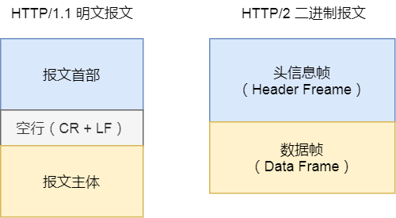
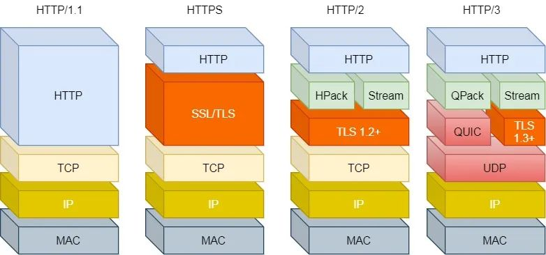
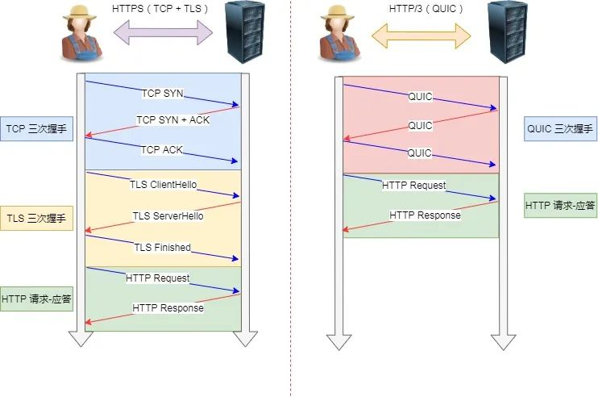

# http1.0、1.1、2.0、3.0的区别

## http1.0对比1.1

由于http协议是建立在TCP协议之上的，那么就逃脱不了TCP协议连接前的三次握手以及断开连接前的四次挥手

http1.0时代请求前需要建立TCP连接，请求完成后断开TCP连接，如果有多个请求那么就会反复建立TCP连接，非常的消耗网络资源

所以http1.1针对1.0的短板进行升级：
- 在http1.1时代新增了keep-alive参数，长连接的方式减少了网络开销
- 支持管道网络传输，及一个请求发出去不需要等待响应在发出第二个

但是1.1也是有性能瓶颈的：
- 请求/响应头不能压缩
- 请求头没有缓存机制，每次请求都需要带着请求头
- 服务器是按照请求顺序进行响应的，如果第一个请求没有响应，则后续的请求需等待，也就是“队头堵塞”
- 请求没有优先级的概念
- 只有客户端能发起请求

## http1.1对比2.0

2.0对1.1的痛点做了很多改善

#### 请求头压缩

- 如果有多个请求，协议会自动删除请求头重复的部分
- 通过HPACK算法，在客户端和服务端维护一个请求头的信息表，表里存放的就是请求头信息，通过发送索引的方式来告诉服务端请求头信息

#### 二进制分帧

2.0不像1.1那样采用明文传输，而是二进制格式传输

并且将请求头和请求体拆分为头信息帧（headers frame）以及数据帧（data frame）

这样对开发者不友好但是对计算机非常友好，这样收到请求报文后不需要将报文转化成二进制在进行解析，而是直接拿到二进制解析，减少了转化流程

#### 数据流

2.0版本的数据包并不是按顺序发送的，响应的时候也不是按照请求顺序响应的，因此需要对数据包做标记，标记属于哪个响应

每个请求/响应的所有数据包，称为一个数据流（stream）

每个数据流都有独一无二的编号，其中规定客户端发出的数据流编号为奇数，服务端响应的数据流编号为偶数

#### 优先级

客户端可以指定数据流的优先级，服务端会对应优先级响应

#### 多路复用

在1.1如果想并发多个请求就需要建立多个TCP通道，而浏览器为了提高性能只限制同时建立4-8个，如果需要并发10个请求的话，就要有两个请求需要等待

在2.0中的所有请求是可以通过一个TCP通道的，请求和响应的顺序不需要一一对应（正因为有流的概念），解决了1.1中队头堵塞的问题

#### 服务端推送

一个页面的加载顺序是请求html，解析html并请求其中引入的js和css

2.0服务端可以向客户端主动推送数据，在客户端请求html的时候，服务端就把可能会用到的js、css、静态资源主动推送给客户端，减少延迟等待，也就是服务端推送（serve push）

#### 2.0有哪些缺陷呢？

http2.0的主要问题在于，如果并发多个请求，TCP是不知道有多少个http请求的

一旦某个请求发生了丢包，就会触发TCP的重传机制，TCP中所有的http请求必须等待这个丢了的包重新传回来

## http3.0

1.1是有队头堵塞的问题，2.0是有丢包堵塞的问题，这都是基于TCP传输层的问题

所以在3.0中直接把TCP协议换成了UDP

UDP是不管顺序也不管丢包的，所以不会出现上述1.1和2.0的问题

但是UDP的安全是不可靠的（没有三次握手）

- 基于UDP的QUIC协议可以实现类似TCP的可靠传输，当某个流发生丢包时，只会阻塞这个流，其他流不会有影响
- TLS升级成1.3版本，头部压缩算法也升级成了QPACK
- https要建立一个连接需要六次握手（先建立连接三次握手，之后TLS三次握手），QUIC直接吧六次握手合并成三次

注意：QUIC是新协议，很多设备不支持，所以3.0普及缓慢