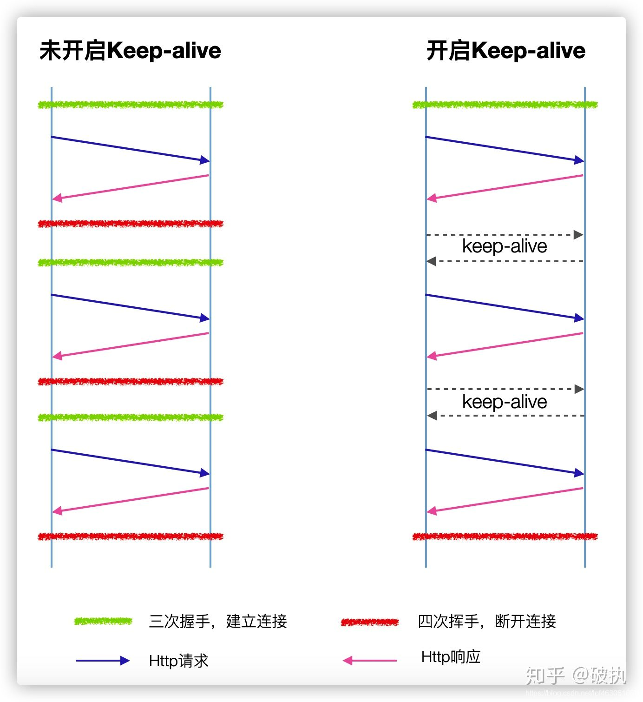

# 性能优化（网络）

## keep-alive

http协议是建立在tcp协议之上的，每次请求都需要建立tcp连接
如果请求头中配置<code>Connection: keep-alive</code>则会保持tcp连接，可以使多个http请求复用



http1.0是默认关闭的，在http1.1会默认开启

浏览器是会限制并发数量的，一般为4-8个，如果需要一次发送20个接口，则会出现排队的现象（因为http1.1即使配置keep-alive也是要等到本次响应结束才能发起下次请求）

如果使用http2.0则不会出现这种情况，http2.0采取多路复用的方式

## 前端兜底网络请求

如果我们把http升级到2.0，有一个业务页面一上来并发200接口，服务器的压力就会增大甚至挂掉，所以我们设计每次只能并发3个

```js
class ConcurrencyLimit {
    constructor(arr = [], limit = 3) {
        this.arr = arr
        this.limit = limit

        this.stack = []
        this.init()
    }

    init() {
        while (true) {
            if (!this.push()) {
                break;
            }
        }
    }

    push() {
        if (this.stack.length >= this.limit || this.arr.length === 0) return;

        const promise = this.arr.shift()
        this.stack.push(promise)
        this.run(promise)

        return promise
    }

    run(promise) {
        promise.finally(() => {
            console.log(this.stack)
            this.stack.splice(this.stack.indexOf(promise), 1)
            this.push()
        })
    }
}

// test
const arr = []

for (let i = 0; i < 20; i++) {
    arr.push(new Promise(res => setTimeout(() => {
        res(i)
    }, Math.random() * 10000)))
}

new ConcurrencyLimit(arr, 3)
```